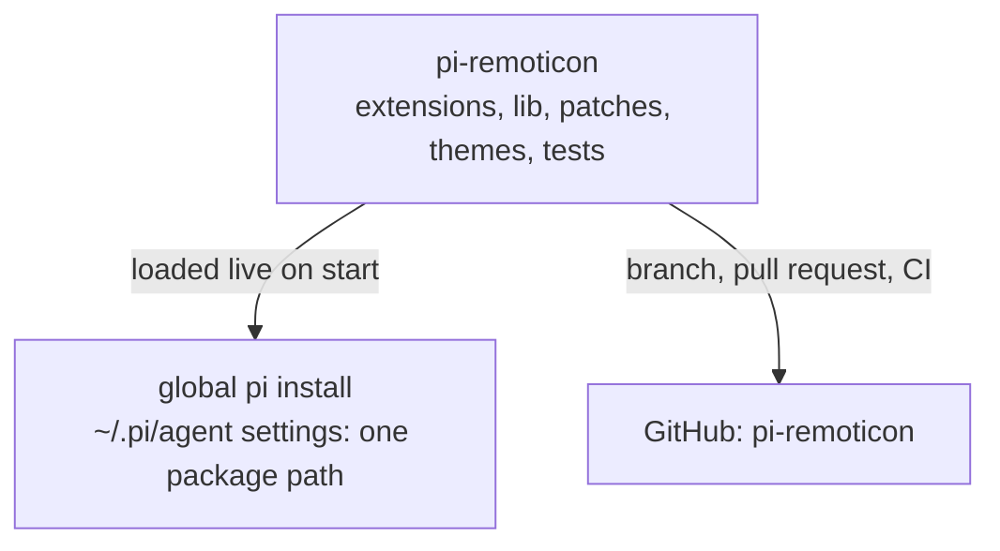
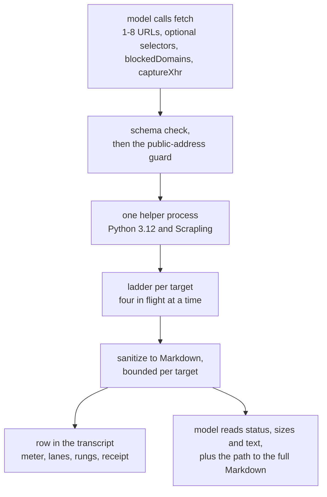
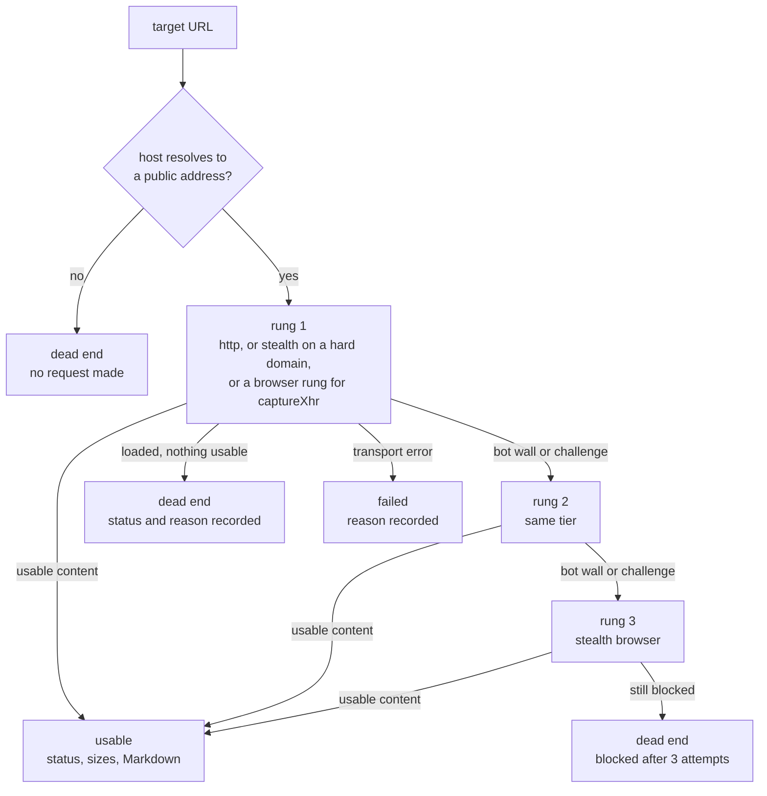

# pi-remoticon

A package that extends the [pi coding agent](https://pi.dev). It adds new capability and a custom interface on top of pi's core, without forking or changing pi itself.

## How it fits together

pi-remoticon is the product; the code lives in this repository. The global pi install loads this folder live through one package path in its settings, so whatever branch is checked out here is what pi runs on the next start.



## What it adds

- A custom interface: a reworked terminal look for the pi TUI (header, footer, tool-group rows).
- Web fetch: a `fetch` tool that retrieves public pages through a local Scrapling escalation ladder and reports truthful status, size and truncation facts per target.
- Subagents: not built yet.

## Install

```
pi install <path-to-repo>
```

`package.json` declares the extension, skill, prompt and theme directories, and pi loads them on every start.

## Python prerequisite (web fetch)

The `fetch` tool needs Python 3.12 with Scrapling. Install it once:

```powershell
conda create -n scrapling python=3.12
conda activate scrapling
pip install -r lib/research/requirements.txt
playwright install chromium
```

pi finds that environment by itself. When `PI_REMOTICON_PYTHON` is set its interpreter is used as given; otherwise `python` on PATH and conda environments named `scrapling` are checked in turn, and the first one that can see both packages wins. If none can, the fetch fails and says what to install. There is no shell setup to remember. Set `PI_REMOTICON_PYTHON` only when the environment has a different name or lives somewhere unusual. The known-good interpreter on this machine is `C:\Users\rajar\miniconda3\envs\scrapling\python.exe`; no absolute interpreter path is embedded in the code. `scrapling==0.4.15` is pinned because the helper uses Scrapling internals that move between releases.

## Web fetch

`fetch` retrieves public pages as cleaned Markdown. One to eight URLs travel in a single batch, fetched four at a time overall and two at a time per domain.

| Parameter | Meaning |
|---|---|
| `targets` | One to eight entries, each with a `url` and an optional CSS `selector`. A selector applies to that target only. |
| `blockedDomains` | Up to 32 bare domains whose browser subrequests are refused, subdomains included. This list never blocks the target's own host. |
| `captureXhr` | A pattern matched against browser background fetch and XHR response URLs. Matches come back with their URL, status and size, each entry bounded. The batch then starts on a browser rung, because plain HTTP cannot capture background requests. Refused on reddit.com targets, whose threads are server-rendered and come back through a plain fetch. |

A target whose host is private, loopback or link-local is refused outright, and a host whose name resolves to a private address is reported as a dead end without a request. Browser subrequests to private addresses are refused, and a redirect to one is recorded as a blocked attempt.



### The escalation ladder

A page that meets a bot wall climbs instead of failing. Rung 2 repeats the first tier, and rung 3 opens the stealth browser with Cloudflare solving enabled. The first rung is plain HTTP, with these exceptions. A known hard domain such as reddit.com starts on the stealth browser, because plain HTTP meets its wall on every attempt and the dynamic tier never clears it. Search engines open on the rung that measured fastest and most reliable: google.com/search on stealth, bing.com/search and the duckduckgo.com search pages on the dynamic browser. A `captureXhr` batch starts on the browser, because plain HTTP cannot capture background requests. Two retired surfaces are refused before any request, each receipt naming the working surface: old.reddit.com and html.duckduckgo.com.

Browser rungs block ads and trackers, and they also block the subrequest domains you list in `blockedDomains`.



Attempts are capped at 7 seconds for plain HTTP, 22 seconds for a browser rung, and 34 seconds for a batch that touches a hard domain or a routed search engine. The whole call stops at 40 seconds and records a reason for every target.

### What the transcript shows

```
Fetched 2 pages · 8.0s
● Fetch(2 URLs concurrently · http → dynamic → stealth)
  ├─ www.reddit.com/r/SillyTavernAI/comments/1w3…reset/  ✓ 200 OK · 84.2KB → 42.1KB main · 5.4s
  │    └ 403 cloudflare 312ms → 403 cloudflare 287ms → 200 4.8s
  └─ en.wikipedia.org/wiki/Scrapling  ✓ 200 OK · 86.4KB → 42.1KB main · 180ms   http 200 ✓
  ── throttle 1.2s on www.reddit.com · browser local · 2 blocks · total 8.0s
```

Every lane carries one target and the rungs it tried, in order, so `403 → 403 → 200` reads as two blocked attempts that climbed to a working one. `main` marks the default main-content extraction; a target that used a selector is labelled with that selector instead. The receipt closes the batch with the delay the helper applied, the browser mode, the blocks it met and the total time. `PI_REMOTICON_MOTION=off` stops the live repaint and leaves the final frame.

The model receives the same facts as text per target, under a header such as `fetch: 2 targets (2 usable, 0 dead ends, 0 failed) | browser mode: local`. When a page exceeds the per-target budget the model gets a bounded slice, and the full sanitized Markdown is saved to a file whose path is printed.

## Development

```
npm ci
npm run test:setup
npm run typecheck
npm run lint
npm test
```

`.github/workflows/ci.yml` runs typecheck, lint and the offline unit + integration suite on every push and pull request (Linux, no network, no Python, no model credentials). Pull requests are also reviewed by CodeRabbit; local pi verification and the merge stay with the owner.

Some TUI behaviour cannot be reached from an extension and is delivered as a maintained pi-core patch (audited against pi 0.85.1 only). Three presentation modules are patched: the assistant message component, the tool group rows and the skill presenter. The fetch row paints its body through the tool-group rule.

```
npm run core-patch -- status  --target <pi-package-root>
npm run core-patch -- apply   --target <pi-package-root>
npm run core-patch -- restore --target <pi-package-root>
```

Close pi before applying or restoring; a pi upgrade requires re-auditing the patch.

## Layout

```
extensions/   TypeScript entry points. Every file here must be a valid pi factory.
lib/          Pure modules the extensions import (no factory rule).
patches/      Maintained pi-core patch sources.
scripts/      Patch, test-setup and preflight tooling.
test/         Offline checks: static, unit, process and PTY integration.
themes/       Theme JSON.
skills/       Skills.
prompts/      Prompt templates.
```
