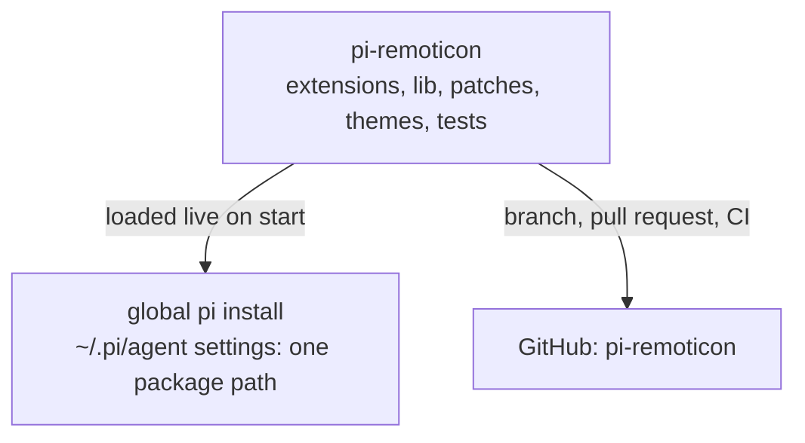

# pi-remoticon

A package that extends the [pi coding agent](https://pi.dev). It adds new capability and a custom interface on top of pi's core, without forking or changing pi itself.

## How it fits together

pi-remoticon is the product; the code lives in this repository. The global pi install loads this folder live through one package path in its settings, so whatever branch is checked out here is what pi runs on the next start.



## What it adds

- A custom interface: a reworked terminal look for the pi TUI (header, footer, tool-group rows).
- Web fetch: a `fetch` tool that retrieves public pages through a local Scrapling escalation ladder and reports truthful status, size and truncation facts per target.
- Subagents: not built yet.

## Install

```
pi install <path-to-repo>
```

`package.json` declares the extension, skill, prompt and theme directories, and pi loads them on every start.

## Python prerequisite (web fetch)

The `fetch` tool runs `lib/research/helper.py` under a Python interpreter that has Scrapling installed:

```powershell
conda create -n scrapling python=3.12
conda activate scrapling
pip install -r lib/research/requirements.txt
playwright install chromium
$env:PI_REMOTICON_PYTHON = (Get-Command python).Source
```

The known-good interpreter on this machine is `C:\Users\rajar\miniconda3\envs\scrapling\python.exe`. When `PI_REMOTICON_PYTHON` is unset the tool falls back to `python` on Windows and `python3` elsewhere on PATH; no absolute interpreter path is embedded in the code. `scrapling==0.4.15` is pinned because the helper uses Scrapling internals that move between releases.

## Development

```
npm ci
npm run test:setup
npm run typecheck
npm run lint
npm test
```

`.github/workflows/ci.yml` runs typecheck, lint and the offline unit + integration suite on every push and pull request (Linux, no network, no Python, no model credentials). Pull requests are also reviewed by CodeRabbit; local pi verification and the merge stay with the owner.

Two TUI behaviours cannot be reached from an extension and are delivered as a maintained pi-core patch (audited against pi 0.85.1 only):

```
npm run core-patch -- status  --target <pi-package-root>
npm run core-patch -- apply   --target <pi-package-root>
npm run core-patch -- restore --target <pi-package-root>
```

Close pi before applying or restoring; a pi upgrade requires re-auditing the patch.

## Layout

```
extensions/   TypeScript entry points. Every file here must be a valid pi factory.
lib/          Pure modules the extensions import (no factory rule).
patches/      Maintained pi-core patch sources.
scripts/      Patch, test-setup and preflight tooling.
test/         Offline checks: static, unit, process and PTY integration.
themes/       Theme JSON.
skills/       Skills.
prompts/      Prompt templates.
```
