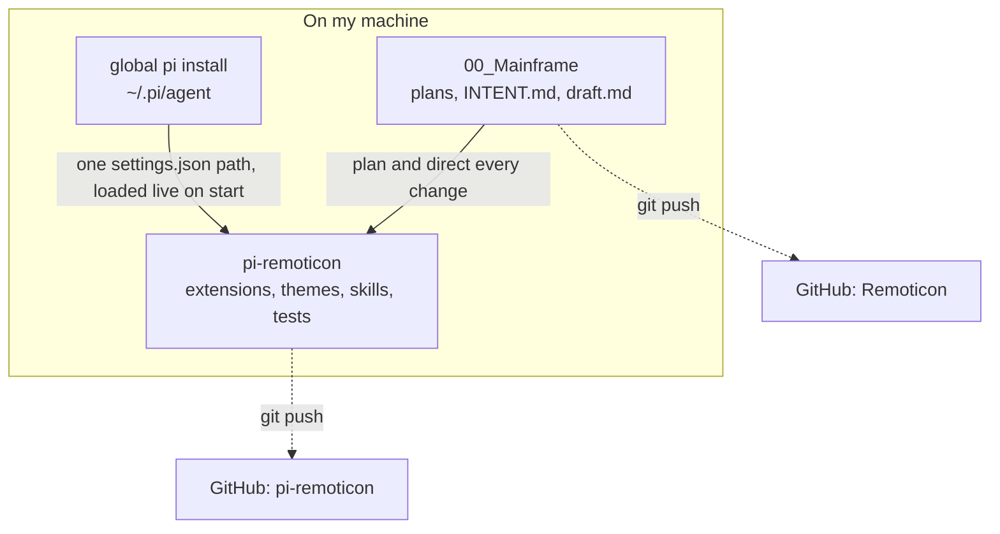

# pi-remoticon

A package that extends the [pi coding agent](https://pi.dev). It adds new capability and a custom interface on top of pi's core, without forking or changing pi itself.

Status: early development. The repository exists, but the features below are planned and not yet built.

## How it fits together

pi-remoticon is the product. Its changes are planned and decided in a separate workspace, 00_Mainframe (on GitHub as [Remoticon](https://github.com/RajarshiB21/Remoticon)). The code lives here in pi-remoticon, and the global pi install loads this folder live through one path entry in its settings.



## What it adds

pi ships a small core. pi-remoticon adds to it through pi's own extension system.

- Subagents. Spawn and supervise child agent processes, stream their output back, and track cost and tokens for each one.
- Web search. Search the web and fetch pages from inside a pi session.
- A custom interface. A reworked terminal look for the pi TUI.

## Install

pi-remoticon is a pi package. Point your pi install at the folder:

```
pi install <path-to-repo>
```

pi then loads it every time it starts.

## Layout

```
extensions/   TypeScript. Tools and interface.
themes/       Theme JSON.
skills/       Skills.
tests/        Checks.
```
