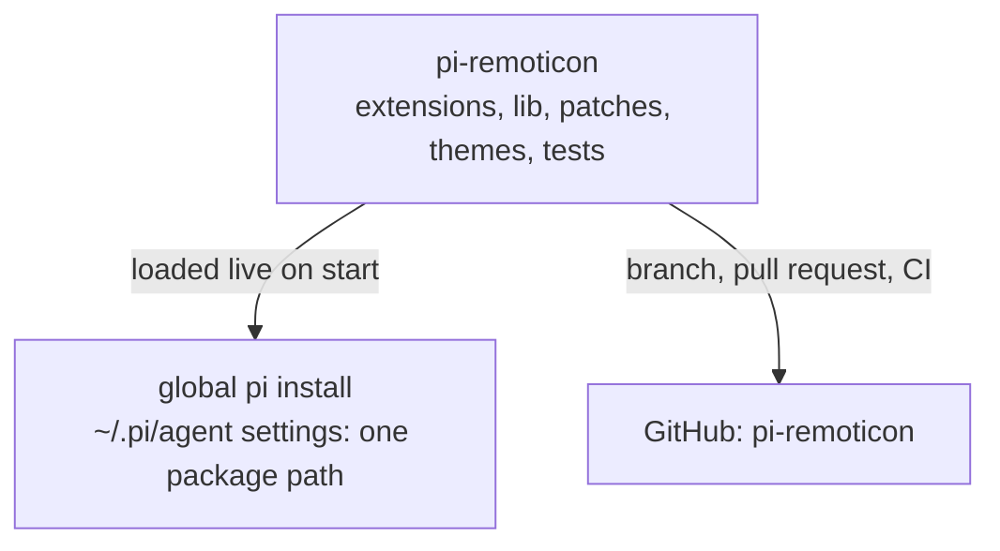

# Research extension port — implementation plan

> **For agentic workers:** REQUIRED SUB-SKILL: Use superpowers:executing-plans to implement this plan task-by-task. Steps use checkbox (`- [ ]`) syntax for tracking.

**Goal:** Port the discarded harness's web-research capability into `pi-remoticon` as a package extension, so the agent can fetch public pages through a Scrapling escalation ladder and see the result painted in the remoticon transcript.

**Architecture:** One factory (`extensions/research.ts`) registers a single `fetch` tool; the tool's real work lives in `lib/research/` (TypeScript protocol/validation/result/row modules plus a verbatim Python helper). The row renders itself (`renderShell: "self"`); the collapsed group line is an extension-supplied `details.groupSummary` string that a generic rule in the maintained core patch displays. Nothing is installed into `C:\Users\rajar\.pi\agent`.

**Tech Stack:** TypeScript on Node ≥22.19 (pi 0.85.1 extension API, TypeBox schemas, pi-tui components), Python 3.12 + Scrapling 0.4.15 + orjson for the helper, Vitest for offline tests, GitHub Actions (Linux, offline) as the gate.

**Spec:** `docs/superpowers/specs/2026-09-13-research-port-design.md` (read it before Task 1; the plan argues from it).

## Execution mode

Inline only. This environment has no pi subagents — do not dispatch subagents, parallel agents or background workers at any point in this plan. Every task runs in the current session, in order, using `superpowers:executing-plans`, and ends with its own commit as written (do not batch tasks into one commit).

Stop and hand back to the user at three checkpoints:

1. **After Task 3** — run the direct interpreter check (Task 3 Step 6) when `PI_REMOTICON_PYTHON` is set in the shell; when it is not set, say so and continue (the helper is exercised live in the user's smoke run).
2. **After Task 6** — a new `UI_HASH` is recorded, but the installed pi patch is still the old revision. Do not apply it; the user closes pi and applies it during visual verification.
3. **After Task 8** — full local gate green; hand over to the After-implementation sequence (visual verification, reviews, push, PR, remote gates, merge).

## Global Constraints

- pi is pinned at `0.85.1` (`PI_VERSION` in `scripts/core-patch-plan.ts`). A pi upgrade requires a fresh audit; do not touch the pinned version.
- Node floor is `>=22.19.0` (`package.json` engines). CI uses Node 24.
- Python dependencies: `scrapling==0.4.15` and `orjson` (`lib/research/requirements.txt`). The helper uses version-sensitive Scrapling internals (`_retry_count`, `_session_kwargs`, `engine._autothrottle`); the pin is the guard.
- The interpreter is `PI_REMOTICON_PYTHON` when set, else `python` on Windows / `python3` elsewhere. **No machine-absolute path may appear in any TypeScript file.** The known-good path (`C:\Users\rajar\miniconda3\envs\scrapling\python.exe`) appears only in the README.
- No new npm dependency. `typebox`, `@earendil-works/pi-tui` and `@earendil-works/pi-coding-agent` are already available (pi's extension loader provides them as virtual modules at runtime; the repo's `node_modules` provides them for typecheck/tests).
- Every file in `extensions/` must be a valid pi factory (`export default function (pi: ExtensionAPI) { ... }`). `test/package-load.integration.test.ts` enforces it.
- Tests are offline: no network, no credentials, no Python, no browsers, no real models. The unit+integration CI step has a hard 2-minute cap (last measured 57 s of 120 s on `main`); the new work adds one PTY boot.
- **Never write to `C:\Users\rajar\.pi\agent`.** The port adds no settings entry, no `APPEND_SYSTEM.md`, no file copy there.
- Only these nine salvage files may be read from `E:\PORT\Workspace\FAILED_DISCARDED`: `.pi/agent/extensions/research/index.ts`, `.pi/agent/src/research/{index,tool,process,protocol,result,validate,render}.ts`, `.pi/agent/src/research/helper.py`. They are read-only reference; copy them into the repo and edit there.
- Palette literals fixed by the spec: running `●` violet `#b9a5e8` = `\x1b[38;2;185;165;232m`; success `#9fcbb4`; error `#e89891`; warning `#ffff00`; dim `#92949e`; accent `#8abeb7`; muted `#a4a5ae`. Use `theme.fg(<token>, …)` for every token except the running violet literal.
- ANSI/control characters from model-supplied URLs must not reach the terminal: `shrinkUrl` removes escape sequences and control bytes, and `test/research-row.test.ts` asserts it.
- Commits are small and per task; the branch is `codex/research-port` off `main`. The user alone merges.

---

## File map (final state)

| Path | Action | Responsibility |
|---|---|---|
| `lib/research/protocol.ts` | copy verbatim | Versioned NDJSON types, strict parser, batch-id check, `pageLadder` |
| `lib/research/validate.ts` | copy verbatim | Target URL, `blockedDomains`, `captureXhr` validation |
| `lib/research/result.ts` | copy + three `.js` suffixes | Model text + `FetchToolDetails` receipt assembly |
| `lib/research/summary.ts` | new | D5 collapsed-group strings (running / settled / cancelled) |
| `lib/research/process.ts` | copy + interpreter/portability edits | Spawn `helper.py`, NDJSON reader, deadline, cancellation |
| `lib/research/helper.py` | copy verbatim + D8 fix | Scrapling escalation ladder (full parity) |
| `lib/research/requirements.txt` | new | `scrapling==0.4.15`, `orjson` |
| `lib/research/row.ts` | rewritten (was `render.ts`) | `●`/`└` fetch rows against remoticon primitives |
| `lib/research/tool.ts` | copy + import rename + `groupSummary` wiring + `activateResearchTools` | The `fetch` tool definition and activation |
| `extensions/research.ts` | new | The only factory: register + activate |
| `patches/runtime/tool-group.ts` | modify | Generic `groupSummary` rule |
| `scripts/core-patch-plan.ts` | modify | New `UI_HASH`, old hash kept as accepted previous |
| `test/helpers/research-fixtures.ts` | new | Shared `page`/`attempt`/`batch` builders |
| `test/research-{protocol,validate,result,summary,process,helper,row,tool,integration}.test.ts` | new | Offline lanes |
| `test/tool-groups.test.ts` | extend | Custom-summary cases |
| `test/preflight.test.ts` | extend | Scan `lib/research/process.ts` for absolute paths |
| `test/fixtures/fake-provider.ts` | extend | `FETCHBAD` emits one `fetch` call |
| `README.md`, `.gitignore` | modify | Prerequisite + workflow truth; ignore `.superpowers/` |
| `docs/superpowers/specs/2026-09-13-research-port-design.md`, `docs/superpowers/plans/2026-09-14-research-port.md` | commit on the branch (Task 1) | The agreed change record the branch implements |

`tsconfig.json` already includes `extensions/**`, `lib/**`, `test/**`, `scripts/**`, `patches/runtime/**`; `package.json` needs no change.

---

### Task 1: Branch setup, protocol port, validation port

**Files:**
- Create: `test/helpers/research-fixtures.ts`
- Create: `lib/research/protocol.ts` (copy of `E:\PORT\Workspace\FAILED_DISCARDED\.pi\agent\src\research\protocol.ts`)
- Create: `lib/research/validate.ts` (copy of `E:\PORT\Workspace\FAILED_DISCARDED\.pi\agent\src\research\validate.ts`)
- Test: `test/research-protocol.test.ts`, `test/research-validate.test.ts`

**Interfaces:**
- Consumes: nothing from earlier tasks.
- Produces: `PROTOCOL_VERSION = 3`, `parseHelperEvent(line): HelperEvent | null`, `assertBatchId(event, batchId): void`, `ProtocolError`, `newBatchId(): string`, `pageLadder(page, attempts)`, types `HelperRequest`, `HelperEvent`, `PageRecord`, `AttemptRecord`, `BatchFinishedEvent`, `AutoThrottleSettings`, `TruncationRecord`, `CapturedXhrRecord`; `validateTargetUrl(url): Error | null`, `validateBlockedDomains(entries, targets): Error | null`, `validateCaptureXhr(pattern): Error | null`, `isPrivateAddress(host): boolean`. Fixtures: `page(over?)`, `attempt(over?)`, `batch(pages, over?)`.

- [ ] **Step 1: Create the branch, record the change record, install the toolchain**

Run:
```bash
cd D:/Workspace/01_Active/pi-remoticon
git checkout main && git pull
git checkout -b codex/research-port
git add docs/superpowers/specs/2026-09-13-research-port-design.md docs/superpowers/plans/2026-09-14-research-port.md
git commit -m "docs: record the research port spec and plan"
npm ci
npm run test:setup
```
Expected: the spec and this plan are committed on the branch (`docs/` was untracked before this step); `npm ci` exits 0; `test:setup` prints its node-pty repair result. (`node_modules/` does not exist yet on a fresh clone.) Leave the untracked `AGENTS.md` alone — it is the user's local workflow file, not part of this port.

- [ ] **Step 2: Write the shared fixtures**

Create `test/helpers/research-fixtures.ts`:
```ts
import { PROTOCOL_VERSION, type AttemptRecord, type BatchFinishedEvent, type PageRecord } from "../../lib/research/protocol.js";

export function page(over: Partial<PageRecord> = {}): PageRecord {
  return {
    targetId: "t0",
    requestedUrl: "https://example.com/",
    finalUrl: null,
    selector: null,
    selectorApplied: false,
    finalStatus: 200,
    finalReason: "OK",
    receivedBytes: 40_000,
    extractedBytes: 20_000,
    usedStealth: false,
    usedAdBlocking: false,
    blockedDomainsCount: 0,
    usable: true,
    deadEndReason: null,
    error: null,
    cancelled: false,
    content: "example body",
    capturedXhr: null,
    truncation: null,
    fullOutputPath: null,
    ...over,
  };
}

export function attempt(over: Partial<AttemptRecord> = {}): AttemptRecord {
  return {
    targetId: "t0",
    url: "https://example.com/",
    attempt: 1,
    tier: "http",
    status: 200,
    reason: "OK",
    receivedBytes: 40_000,
    latencyMs: 120,
    waitMs: null,
    retryAfterSeconds: null,
    blockedSignal: null,
    unusableSignal: null,
    startedAt: 1,
    completedAt: 2,
    ...over,
  };
}

export function batch(pages: PageRecord[], over: Partial<BatchFinishedEvent> = {}): BatchFinishedEvent {
  return {
    protocolVersion: PROTOCOL_VERSION,
    type: "batch_finished",
    batchId: "b-test",
    completedAt: 2,
    browserMode: "none",
    autoThrottle: { enabled: true, startDelayMs: 250, maxDelayMs: 30_000, blockBackoff: true, observedDelays: {} },
    stats: { blockedCount: 0, failedCount: 0, requestCount: pages.length },
    pages,
    ...over,
  };
}
```

- [ ] **Step 3: Write the failing protocol test**

Create `test/research-protocol.test.ts`:
```ts
import { describe, it, expect } from "vitest";
import {
  assertBatchId, pageLadder, parseHelperEvent, PROTOCOL_VERSION, ProtocolError,
} from "../lib/research/protocol.js";
import { attempt, page } from "./helpers/research-fixtures.js";

const envelope = (type: string, extra: Record<string, unknown> = {}, batchId: string | null = "b-1") =>
  JSON.stringify({ protocolVersion: PROTOCOL_VERSION, type, batchId, ...extra });

describe("parseHelperEvent", () => {
  it("accepts every envelope and rejects anything else", () => {
    expect(parseHelperEvent("")).toBeNull();
    expect(parseHelperEvent("   ")).toBeNull();
    expect(parseHelperEvent(envelope("batch_started"))?.type).toBe("batch_started");
    expect(parseHelperEvent(envelope("attempt_finished"))?.type).toBe("attempt_finished");
    expect(parseHelperEvent(envelope("target_finished"))?.type).toBe("target_finished");
    expect(parseHelperEvent(envelope("batch_finished"))?.type).toBe("batch_finished");
    expect(parseHelperEvent(envelope("fatal_error", { error: "x" }, null))?.type).toBe("fatal_error");
    expect(() => parseHelperEvent("not json")).toThrow(ProtocolError);
    expect(() => parseHelperEvent("[1,2]")).toThrow(/JSON object/);
    expect(() => parseHelperEvent(JSON.stringify({ protocolVersion: PROTOCOL_VERSION - 1, type: "batch_started", batchId: "b-1" }))).toThrow(/protocolVersion/);
    expect(() => parseHelperEvent(envelope("surprise"))).toThrow(/unknown event type/);
    expect(() => parseHelperEvent(JSON.stringify({ protocolVersion: PROTOCOL_VERSION, type: "batch_started" }))).toThrow(/no batchId/);
    expect(() => parseHelperEvent(envelope("batch_started", {}, ""))).toThrow(/no batchId/);
  });

  it("checks batch identity, allowing only a pre-batch fatal_error", () => {
    const started = parseHelperEvent(envelope("batch_started"))!;
    expect(() => assertBatchId(started, "b-1")).not.toThrow();
    expect(() => assertBatchId(started, "b-2")).toThrow(/batchId/);
    const fatal = parseHelperEvent(envelope("fatal_error", { error: "x" }, null))!;
    expect(() => assertBatchId(fatal, "b-1")).not.toThrow();
  });
});

describe("pageLadder", () => {
  it("derives escalation only from real attempt records", () => {
    expect(pageLadder(page(), [attempt()])).toBeNull();

    const blocked = [attempt({ blockedSignal: "cloudflare", status: 403, reason: "Forbidden" }), attempt({ attempt: 2, tier: "stealth" })];
    expect(pageLadder(page({ usedStealth: true }), blocked)).toEqual({
      firstStatus: 403, firstTier: "http", finalTier: "stealth", recovered: true, firstKind: "blocked",
    });

    const empty = [attempt({ unusableSignal: "empty content" }), attempt({ attempt: 2, tier: "dynamic" })];
    expect(pageLadder(page(), empty)?.firstKind).toBe("empty");

    const transport = [attempt({ status: null, reason: "connection reset" }), attempt({ attempt: 2, tier: "stealth" })];
    expect(pageLadder(page(), transport)?.firstKind).toBe("failed");

    const gaveUp = [attempt({ blockedSignal: "cloudflare", status: 403 }), attempt({ attempt: 2, tier: "stealth", blockedSignal: "cloudflare", status: 403 })];
    expect(pageLadder(page({ usable: false, deadEndReason: "blocked after 2 attempts, including stealth" }), gaveUp)?.recovered).toBe(false);
  });
});
```

- [ ] **Step 4: Run it to verify it fails**

Run: `npx vitest run test/research-protocol.test.ts`
Expected: FAIL — `Cannot find module '../lib/research/protocol.js'` (fixtures import the missing module too).

- [ ] **Step 5: Copy `protocol.ts` and make the test pass**

Run:
```bash
mkdir -p lib/research
cp "E:/PORT/Workspace/FAILED_DISCARDED/.pi/agent/src/research/protocol.ts" lib/research/protocol.ts
npx vitest run test/research-protocol.test.ts
```
Expected: PASS. `protocol.ts` has no relative imports, so no suffix edits. If any assertion fails, the copy is not the verified source — re-copy; do not patch the test.

- [ ] **Step 6: Write the failing validation test**

Create `test/research-validate.test.ts`:
```ts
import { afterEach, describe, expect, it } from "vitest";
import { isPrivateAddress, validateBlockedDomains, validateCaptureXhr, validateTargetUrl } from "../lib/research/validate.js";

const loopback = process.env.PI_RESEARCH_TEST_ALLOW_LOOPBACK;
afterEach(() => {
  if (loopback === undefined) delete process.env.PI_RESEARCH_TEST_ALLOW_LOOPBACK;
  else process.env.PI_RESEARCH_TEST_ALLOW_LOOPBACK = loopback;
});

describe("validateTargetUrl", () => {
  it("accepts public http(s) and rejects everything else", () => {
    expect(validateTargetUrl("https://example.com/page")).toBeNull();
    expect(validateTargetUrl("http://example.com")).toBeNull();
    expect(validateTargetUrl("ftp://example.com/file")?.message).toMatch(/not public http\(s\)/);
    expect(validateTargetUrl("not a url")?.message).toMatch(/not a valid URL/);
    expect(validateTargetUrl("https://user:pw@example.com")?.message).toMatch(/credentials/);
    expect(validateTargetUrl("http://localhost/")?.message).toMatch(/not public/);
    expect(validateTargetUrl("http://127.0.0.1/")?.message).toMatch(/private|not public/);
    expect(validateTargetUrl("http://10.0.0.5/")?.message).toMatch(/private|not public/);
    expect(validateTargetUrl("http://[::1]/")?.message).toMatch(/private|not public/);
  });

  it("allows loopback only behind the documented test gate", () => {
    process.env.PI_RESEARCH_TEST_ALLOW_LOOPBACK = "1";
    expect(validateTargetUrl("http://127.0.0.1:8080/")).toBeNull();
  });
});

describe("validateBlockedDomains", () => {
  it("accepts bare subdomains and rejects bad shapes or the target's own host", () => {
    const targets = [{ url: "https://en.wikipedia.org/wiki/Scrapling" }];
    expect(validateBlockedDomains(undefined, targets)).toBeNull();
    expect(validateBlockedDomains(["ads.example.com"], targets)).toBeNull();
    expect(validateBlockedDomains(["https://ads.example.com"], targets)?.message).toMatch(/bare domain/);
    expect(validateBlockedDomains(Array.from({ length: 33 }, (_, i) => `d${i}.example.com`), targets)?.message).toMatch(/at most 32/);
    expect(validateBlockedDomains(["ads.example.com", "ADS.example.com"], targets)?.message).toMatch(/duplicates/);
    expect(validateBlockedDomains(["wikipedia.org"], targets)?.message).toMatch(/would block target host/);
  });
});

describe("validateCaptureXhr", () => {
  it("accepts a compiling pattern and rejects junk before any work", () => {
    expect(validateCaptureXhr(undefined)).toBeNull();
    expect(validateCaptureXhr("/api/comments")).toBeNull();
    expect(validateCaptureXhr("")?.message).toMatch(/non-empty/);
    expect(validateCaptureXhr("a".repeat(201))?.message).toMatch(/too long/);
    expect(validateCaptureXhr("(")?.message).toMatch(/not a valid pattern/);
  });
});

describe("isPrivateAddress", () => {
  it("covers the rejected ranges", () => {
    for (const host of ["127.0.0.1", "10.1.2.3", "172.16.0.1", "192.168.1.1", "169.254.1.1", "0.0.0.0", "224.0.0.1", "::1", "fe80::1", "fc00::1", "fd12::1"]) {
      expect(isPrivateAddress(host), host).toBe(true);
    }
    for (const host of ["8.8.8.8", "172.32.0.1", "example.com", "2001:4860:4860::8888"]) {
      expect(isPrivateAddress(host), host).toBe(false);
    }
  });
});
```

- [ ] **Step 7: Run it to verify it fails, copy `validate.ts`, run again**

Run:
```bash
npx vitest run test/research-validate.test.ts   # FAIL: module not found
cp "E:/PORT/Workspace/FAILED_DISCARDED/.pi/agent/src/research/validate.ts" lib/research/validate.ts
npx vitest run test/research-validate.test.ts   # PASS
```
Expected: FAIL then PASS. `validate.ts` has no relative imports.

- [ ] **Step 8: Typecheck and commit**

Run: `npm run typecheck`
Expected: exit 0.
```bash
git add lib/research/protocol.ts lib/research/validate.ts test/helpers/research-fixtures.ts test/research-protocol.test.ts test/research-validate.test.ts
git commit -m "feat: port research protocol and target validation"
```

---

### Task 2: Result assembly and the collapsed-summary strings

**Files:**
- Create: `lib/research/result.ts` (copy of `E:\PORT\...\src\research\result.ts`)
- Create: `lib/research/summary.ts`
- Test: `test/research-result.test.ts`, `test/research-summary.test.ts`

**Interfaces:**
- Consumes: `protocol.ts`, fixtures from Task 1.
- Produces: `buildModelResult(batchFinished, attempts?): { text: string; totalTruncated: boolean }`, `buildDetails(request, batchStarted, batchFinished, attempts, cancelled): FetchToolDetails`, `allTargetsFailed(pages): boolean`, `firstFailureSummary(pages): string`, `summaryCounts(pages): string`, `type FetchToolDetails`; `runningSummary(count): string`, `settledSummary(pages): string`, `CANCELLED_SUMMARY: string`.

- [ ] **Step 1: Write the failing result test**

Create `test/research-result.test.ts`:
```ts
import { describe, expect, it } from "vitest";
import { allTargetsFailed, buildDetails, buildModelResult, firstFailureSummary, summaryCounts } from "../lib/research/result.js";
import { PROTOCOL_VERSION, type HelperRequest } from "../lib/research/protocol.js";
import { attempt, batch, page } from "./helpers/research-fixtures.js";

const request: HelperRequest = {
  protocolVersion: PROTOCOL_VERSION,
  batchId: "b-test",
  outputDir: ".",
  targets: [{ id: "t0", url: "https://example.com/" }],
};

describe("buildModelResult", () => {
  it("carries the counts, the dead end and the batch stats", () => {
    const pages = [
      page(),
      page({ targetId: "t1", requestedUrl: "https://example.com/missing", usable: false, finalStatus: 404, finalReason: "Not Found", deadEndReason: "not found" }),
    ];
    const { text } = buildModelResult(batch(pages), [attempt(), attempt({ targetId: "t1", status: 404, reason: "Not Found" })]);
    expect(text).toContain("fetch: 2 targets (1 usable, 1 dead end, 0 failed) | browser mode: none");
    expect(text).toContain("[2/2] https://example.com/missing");
    expect(text).toContain("status dead end: not found");
    expect(text).toContain("http 404 Not Found");
    expect(text).toContain("batch stats: responses 2 | blocks 0 | failed 0");
  });

  it("names a real recovery and a per-target truncation with its saved path", () => {
    const recovered = page({ usedStealth: true });
    const truncated = page({ targetId: "t1", truncation: { truncated: true, keptBytes: 16_384, totalBytes: 43_000, outputPath: "t1.md" } });
    const attempts = [attempt({ blockedSignal: "cloudflare", status: 403, reason: "Forbidden" }), attempt({ attempt: 2, tier: "stealth" })];
    const { text, totalTruncated } = buildModelResult(batch([recovered, truncated]), attempts);
    expect(text).toContain("recovered: first 403 (http) -> final 200 (stealth)");
    expect(text).toContain("[truncated for the model: kept 16.0KB of 42.0KB; full sanitized markdown saved to t1.md]");
    expect(totalTruncated).toBe(false);
  });

  it("bounds the whole result and says so", () => {
    const huge = page({ content: "line\n".repeat(3_000) });
    const { text, totalTruncated } = buildModelResult(batch([huge]), []);
    expect(totalTruncated).toBe(true);
    expect(text).toContain("[fetch output truncated for the model:");
  });
});

describe("details and failure helpers", () => {
  it("builds the receipt and names the first failure", () => {
    const pages = [page({ usable: false, error: "connection reset" })];
    const details = buildDetails(request, null, batch(pages), [], false);
    expect(details.batchId).toBe("b-test");
    expect(details.pages).toHaveLength(1);
    expect(details.browserMode).toBe("none");
    expect(allTargetsFailed(pages)).toBe(true);
    expect(firstFailureSummary(pages)).toBe("https://example.com/");
    expect(summaryCounts(pages)).toBe("0 usable, 0 dead ends, 1 failed");
    expect(allTargetsFailed([page()])).toBe(false);
  });
});
```

- [ ] **Step 2: Run it to verify it fails**

Run: `npx vitest run test/research-result.test.ts`
Expected: FAIL — `Cannot find module '../lib/research/result.js'`.

- [ ] **Step 3: Copy `result.ts` and fix its three relative specifiers**

Run:
```bash
cp "E:/PORT/Workspace/FAILED_DISCARDED/.pi/agent/src/research/result.ts" lib/research/result.ts
```
Then, in `lib/research/result.ts`, change the three `"./protocol"` specifiers to `"./protocol.js"` (nothing else changes):
```ts
import type { BatchFinishedEvent, HelperRequest, PageRecord } from "./protocol.js";
import type { AttemptRecord } from "./protocol.js";
import { pageLadder } from "./protocol.js";
```

- [ ] **Step 4: Write the failing summary test**

Create `test/research-summary.test.ts`:
```ts
import { describe, expect, it } from "vitest";
import { CANCELLED_SUMMARY, runningSummary, settledSummary } from "../lib/research/summary.js";
import { page } from "./helpers/research-fixtures.js";

describe("group summaries", () => {
  it("names the three states in plain text", () => {
    expect(runningSummary(3)).toBe("Fetching 3 pages…");
    expect(runningSummary(1)).toBe("Fetching 1 page…");
    expect(CANCELLED_SUMMARY).toBe("Fetch cancelled");
    expect(settledSummary([page()])).toBe("Fetched 1 page");
    expect(settledSummary([page(), page({ targetId: "t1" })])).toBe("Fetched 2 pages");
    expect(settledSummary([page(), page({ targetId: "t1", usable: false, deadEndReason: "not found" })])).toBe("Fetched 2 pages · 1 dead end");
    expect(settledSummary([page(), page({ targetId: "t1", usable: false, error: "boom" }), page({ targetId: "t2", usable: false, error: "boom" })])).toBe("Fetched 3 pages · 2 failed");
    expect(settledSummary([page(), page({ targetId: "t1", usable: false, deadEndReason: "not found" }), page({ targetId: "t2", usable: false, error: "boom" })])).toBe("Fetched 3 pages · 1 dead end · 1 failed");
  });

  it("stays free of control characters and ANSI", () => {
    const strings = [runningSummary(2), settledSummary([page({ usable: false, deadEndReason: "x" })]), CANCELLED_SUMMARY];
    for (const value of strings) expect(value).not.toMatch(/[\u0000-\u001f\u007f]|\x1b\[/);
  });
});
```

- [ ] **Step 5: Run it to verify it fails, then write `summary.ts`**

Run: `npx vitest run test/research-summary.test.ts`
Expected: FAIL — module not found.

Create `lib/research/summary.ts`:
```ts
/**
 * Collapsed-group strings for the fetch tool (design D5, 2026-09-13).
 * The patched runtime shows these verbatim on the group line, so they are
 * plain text: no ANSI, no control characters, recomputed on every update.
 */
import type { PageRecord } from "./protocol.js";

export const CANCELLED_SUMMARY = "Fetch cancelled";

export function runningSummary(targetCount: number): string {
  return `Fetching ${targetCount} page${targetCount === 1 ? "" : "s"}…`;
}

export function settledSummary(pages: readonly PageRecord[]): string {
  const dead = pages.filter((page) => !page.usable && page.error === null && !page.cancelled).length;
  const failed = pages.filter((page) => !page.usable && page.error !== null).length;
  const parts = [`Fetched ${pages.length} page${pages.length === 1 ? "" : "s"}`];
  if (dead > 0) parts.push(`${dead} dead end${dead === 1 ? "" : "s"}`);
  if (failed > 0) parts.push(`${failed} failed`);
  return parts.join(" · ");
}
```

- [ ] **Step 6: Run both tests, typecheck, commit**

Run: `npx vitest run test/research-result.test.ts test/research-summary.test.ts && npm run typecheck`
Expected: PASS. (If `fetch output truncated` fails, the huge page is not large enough — the bound is 50 KiB / 2,000 lines and `"line\n".repeat(3_000)` is 3,000 lines, so it must trip.)
```bash
git add lib/research/result.ts lib/research/summary.ts test/research-result.test.ts test/research-summary.test.ts
git commit -m "feat: port fetch result assembly and collapsed summaries"
```

---

### Task 3: The Python helper and its spawner

**Files:**
- Create: `lib/research/helper.py` (copy of `E:\PORT\...\src\research\helper.py`, D8 fix)
- Create: `lib/research/requirements.txt`
- Create: `lib/research/process.ts` (copy of `E:\PORT\...\src\research\process.ts`, three edits)
- Test: `test/research-helper.test.ts`, `test/research-process.test.ts`

**Interfaces:**
- Consumes: `protocol.ts` (`parseHelperEvent`, `assertBatchId`, `HelperEvent`, `HelperRequest`).
- Produces: `runHelper(request, signal?, onEvent?, spawnForTest?, deadlineMs?): HelperRun`, `helperScriptPath(): string`, `resolveHelperInterpreter(): string`, `DEFAULT_HELPER_DEADLINE_MS = 40_000`, `HelperCancelledError`, `HelperDeadlineError`, `type SpawnOverride`.

- [ ] **Step 1: Write the failing helper source test**

Create `test/research-helper.test.ts`:
```ts
import { describe, expect, it } from "vitest";
import { readFileSync } from "node:fs";
import { fileURLToPath } from "node:url";
import { dirname, join } from "node:path";

const root = dirname(dirname(fileURLToPath(import.meta.url)));
const helper = readFileSync(join(root, "lib", "research", "helper.py"), "utf8");

describe("helper source", () => {
  it("builds the emitter before validating outputDir (D8)", () => {
    const main = helper.slice(helper.indexOf("def main()"));
    const emitter = main.indexOf("emitter = Emitter(batch_id)");
    const outputDir = main.indexOf('output_dir = payload.get("outputDir")');
    expect(emitter).toBeGreaterThan(-1);
    expect(outputDir).toBeGreaterThan(emitter);
  });

  it("pins the version-sensitive Scrapling surface", () => {
    const requirements = readFileSync(join(root, "lib", "research", "requirements.txt"), "utf8");
    expect(requirements).toContain("scrapling==0.4.15");
    expect(helper).toContain("from scrapling.fetchers import AsyncDynamicSession, AsyncStealthySession, FetcherSession");
  });

  it("carries no machine-absolute path", () => {
    expect(/[A-Za-z]:\\|\/(?:home|Users|tmp|root|var|opt|mnt|media|private)\//.test(helper)).toBe(false);
  });
});
```

- [ ] **Step 2: Run it to verify it fails, then copy the helper and pin its deps**

Run:
```bash
npx vitest run test/research-helper.test.ts   # FAIL: ENOENT helper.py
cp "E:/PORT/Workspace/FAILED_DISCARDED/.pi/agent/src/research/helper.py" lib/research/helper.py
printf 'scrapling==0.4.15\norjson\n' > lib/research/requirements.txt
```
Then apply the D8 fix in `lib/research/helper.py`. In `main()`, move the emitter construction above the `outputDir` validation and delete the later line, so the block reads:
```python
        # The emitter exists from here on, so every later fatal_error carries
        # the batchId and the tool can surface the real reason.
        emitter = Emitter(batch_id)
        output_dir = payload.get("outputDir")
        if not isinstance(output_dir, str) or not output_dir or not os.path.isdir(output_dir):
            fatal_error(emitter, "request outputDir is missing or not a directory")
            return
        targets = payload.get("targets")
        if not isinstance(targets, list) or not (1 <= len(targets) <= 8):
            fatal_error(emitter, f"targets must be an array of 1..8, got {type(targets).__name__}")
            return
        for index, target in enumerate(targets):
```
i.e. the old `        emitter = Emitter(batch_id)` line that sat between the targets check and the `for index, target` loop is removed. Nothing else in `helper.py` changes. Run the test again — expected: PASS.

- [ ] **Step 3: Write the failing process test**

Create `test/research-process.test.ts`:
```ts
import { describe, expect, it } from "vitest";
import { spawn, type ChildProcess } from "node:child_process";
import { existsSync } from "node:fs";
import {
  DEFAULT_HELPER_DEADLINE_MS, HelperCancelledError, HelperDeadlineError,
  helperScriptPath, resolveHelperInterpreter, runHelper,
} from "../lib/research/process.js";
import { PROTOCOL_VERSION, type HelperRequest } from "../lib/research/protocol.js";

const request = (batchId = "b-test"): HelperRequest => ({
  protocolVersion: PROTOCOL_VERSION,
  batchId,
  outputDir: ".",
  targets: [{ id: "t0", url: "https://example.com/" }],
});

const BATCH_STARTED = `emit({ type: "batch_started", startedAt: 1, browserMode: "none", globalConcurrency: 4, perDomainConcurrency: 2, maxBlockedRetries: 2, autoThrottle: { enabled: true, startDelayMs: 250, maxDelayMs: 30000, blockBackoff: true }, targetCount: 1 });`;

/** A Node stand-in for helper.py: read the request, run the body, exit. */
function nodeHelper(body: string): ChildProcess {
  const script = [
    'let data = "";',
    'process.stdin.on("data", (chunk) => { data += chunk; });',
    'process.stdin.on("end", () => {',
    "  const request = JSON.parse(data);",
    '  const emit = (event) => process.stdout.write(JSON.stringify({ protocolVersion: request.protocolVersion, batchId: request.batchId, ...event }) + "\\n");',
    body,
    "});",
  ].join("\n");
  return spawn(process.execPath, ["-e", script], { stdio: ["pipe", "pipe", "pipe"] });
}

describe("runHelper", () => {
  it("resolves the interpreter from PI_REMOTICON_PYTHON, else a PATH name", () => {
    const before = process.env.PI_REMOTICON_PYTHON;
    try {
      delete process.env.PI_REMOTICON_PYTHON;
      expect(resolveHelperInterpreter()).toBe(process.platform === "win32" ? "python" : "python3");
      process.env.PI_REMOTICON_PYTHON = "   /opt/scrapling/bin/python   ";
      expect(resolveHelperInterpreter()).toBe("/opt/scrapling/bin/python");
    } finally {
      if (before === undefined) delete process.env.PI_REMOTICON_PYTHON;
      else process.env.PI_REMOTICON_PYTHON = before;
    }
  });

  it("resolves helper.py next to the module", () => {
    const script = helperScriptPath();
    expect(script.endsWith("helper.py")).toBe(true);
    expect(existsSync(script)).toBe(true);
  });

  it("resolves a bounded batch and keeps the events", async () => {
    const run = runHelper(request(), undefined, undefined, () => nodeHelper([
      BATCH_STARTED,
      'emit({ type: "target_finished", page: {} });',
      'emit({ type: "batch_finished", completedAt: 2, browserMode: "none", autoThrottle: { enabled: true, startDelayMs: 250, maxDelayMs: 30000, blockBackoff: true, observedDelays: {} }, stats: { blockedCount: 0, failedCount: 0, requestCount: 0 }, pages: [] });',
    ].join("\n")));
    const events = await run.completion;
    expect(events.map((event) => event.type)).toEqual(["batch_started", "target_finished", "batch_finished"]);
    expect(DEFAULT_HELPER_DEADLINE_MS).toBe(40_000);
    expect(await run.exitInfo).toEqual({ code: 0 });
  });

  it("surfaces a fatal_error with the helper's reason", async () => {
    const run = runHelper(request(), undefined, undefined, () => nodeHelper([
      'emit({ type: "fatal_error", batchId: null, error: "boom" });',
      "process.exit(1);",
    ].join("\n")));
    await expect(run.completion).rejects.toThrow(/fetch helper failed: boom/);
  });

  it("rejects a malformed stdout line", async () => {
    const run = runHelper(request(), undefined, undefined, () => nodeHelper([
      'process.stdout.write("not json\\n");',
      "setTimeout(() => {}, 30000);",
    ].join("\n")));
    await expect(run.completion).rejects.toThrow(/not JSON/);
  });

  it("stops at the deadline and keeps the events collected so far", async () => {
    const run = runHelper(request(), undefined, undefined, () => nodeHelper([
      BATCH_STARTED,
      "setTimeout(() => {}, 30000);",
    ].join("\n")), undefined, 100);
    const error = await run.completion.catch((reason: unknown) => reason);
    expect(error).toBeInstanceOf(HelperDeadlineError);
    expect((error as HelperDeadlineError).timeoutMs).toBe(100);
    expect((error as HelperDeadlineError).events.map((event) => event.type)).toEqual(["batch_started"]);
  });

  it("cancels the whole tree and settles once", async () => {
    const run = runHelper(request(), undefined, undefined, () => nodeHelper([
      BATCH_STARTED,
      "setTimeout(() => {}, 30000);",
    ].join("\n")));
    await new Promise((resolve) => setTimeout(resolve, 50));
    await run.cancel("user escape");
    await expect(run.completion).rejects.toBeInstanceOf(HelperCancelledError);
  });

  it("rejects when the abort signal fires", async () => {
    const controller = new AbortController();
    const run = runHelper(request(), controller.signal, undefined, () => nodeHelper([
      BATCH_STARTED,
      "setTimeout(() => {}, 30000);",
    ].join("\n")));
    controller.abort();
    await expect(run.completion).rejects.toBeInstanceOf(HelperCancelledError);
  });

  it("names PI_REMOTICON_PYTHON when the helper cannot start", async () => {
    const run = runHelper(request(), undefined, undefined, () => spawn("pi-remoticon-no-such-binary-xyz", []));
    await expect(run.completion).rejects.toThrow(/PI_REMOTICON_PYTHON.*scrapling==0\.4\.15/);
  });
});
```

- [ ] **Step 4: Run it to verify it fails**

Run: `npx vitest run test/research-process.test.ts`
Expected: FAIL — `Cannot find module '../lib/research/process.js'`.

- [ ] **Step 5: Copy `process.ts` and apply the three port edits**

Run:
```bash
cp "E:/PORT/Workspace/FAILED_DISCARDED/.pi/agent/src/research/process.ts" lib/research/process.ts
```
Edit 1 — relative import gains the `.js` suffix:
```ts
import { assertBatchId, parseHelperEvent, type HelperEvent, type HelperRequest } from "./protocol.js";
```
Edit 2 — replace the hardcoded interpreter constant with D6 resolution plus the documented failure hint; remove `export const HELPER_INTERPRETER = "C:/Users/rajar/miniconda3/envs/scrapling/python.exe";`:
```ts
/** Interpreter resolution (design D6): no machine-absolute path anywhere. */
export function resolveHelperInterpreter(): string {
	const configured = process.env.PI_REMOTICON_PYTHON?.trim();
	if (configured) return configured;
	return process.platform === "win32" ? "python" : "python3";
}

const INTERPRETER_HINT = " (set PI_REMOTICON_PYTHON to a Python interpreter with scrapling==0.4.15 and orjson installed)";
```
and replace the spawn call:
```ts
	const child = spawnForTest
		? spawnForTest()
		: spawn(resolveHelperInterpreter(), [helperScriptPath()], {
				stdio: ["pipe", "pipe", "pipe"],
				windowsHide: true,
			});
```
Edit 3 — the tree kill is Windows-only (`taskkill` does not exist on the Linux CI machine, and an unhandled spawn error would abort the test process); every helper-start/import failure names the env var; and the stdin write is guarded:
```ts
/** Terminate the whole child tree on Windows; kill() alone only kills python.exe. */
function killProcessTree(child: ChildProcess): void {
	if (process.platform === "win32" && child.pid !== undefined) {
		try {
			spawn("taskkill", ["/PID", String(child.pid), "/T", "/F"], { windowsHide: true });
		} catch {
			// Falls through to the plain kill below.
		}
	}
	try {
		child.kill();
	} catch {
		// Already exiting.
	}
}
```
```ts
	let stdin = child.stdin;
	if (stdin) {
		stdin.on("error", () => { /* EPIPE after an early helper exit; the exit handler decides. */ });
		stdin.write(JSON.stringify(request) + "\n");
		stdin.end();
	}
```
and append `INTERPRETER_HINT` to the three failure messages that mean "no batch_finished arrived":
```ts
			settle("reject", new Error(`fetch helper failed: ${fatal?.error ?? "unknown fatal error"}${stderrTailText(STDERR_TAIL_SHOWN)}${INTERPRETER_HINT}`));
...
			settle("reject", new Error(`helper exited (code ${code}) without batch_finished${stderrTailText(STDERR_TAIL_SHOWN)}${INTERPRETER_HINT}`));
...
		settle("reject", new Error(`failed to start fetch helper: ${error.message}${stderrTailText(STDERR_TAIL_SHOWN)}${INTERPRETER_HINT}`));
```
Nothing else changes: `DEFAULT_HELPER_DEADLINE_MS = 40_000`, the 16 KiB stderr capture, the 600-char tail, the `taskkill /T /F`-then-`kill()` order on Windows, the settle-once semantics and the `spawnForTest` seam all stay as copied.

- [ ] **Step 6: Check the real interpreter and the helper's imports (only when PI_REMOTICON_PYTHON is set)**

This is the smallest direct check for the spec's third uncertain mechanism ("`PI_REMOTICON_PYTHON` resolution and the helper's Scrapling imports — one direct interpreter invocation"). Skip it and say so in the hand-off note when the variable is not set in the current shell.

Run (PowerShell):
```powershell
& $env:PI_REMOTICON_PYTHON -c "import scrapling, orjson; print('deps ok')"
"" | & $env:PI_REMOTICON_PYTHON lib/research/helper.py
```
Expected: the first command prints `deps ok`. The second reads one empty line on stdin, prints one NDJSON line on stdout — `{"protocolVersion":3,"type":"fatal_error","batchId":null,"error":"JSONDecodeError: ..."}` — and exits 1. That exit code is expected: the helper started, the imports resolved, and it reported the empty request truthfully. Record both outputs.

- [ ] **Step 7: Run the tests, typecheck, commit**

Run: `npx vitest run test/research-process.test.ts test/research-helper.test.ts && npm run typecheck`
Expected: PASS (all eight process cases and three helper cases).
```bash
git add lib/research/helper.py lib/research/requirements.txt lib/research/process.ts test/research-helper.test.ts test/research-process.test.ts
git commit -m "feat: port the scrapling helper and its spawner"
```

---

### Task 4: The fetch row renderer

**Files:**
- Create: `lib/research/row.ts` (rewrite of the old `render.ts`)
- Test: `test/research-row.test.ts`

**Interfaces:**
- Consumes: `pageLadder`, `AttemptRecord`, `PageRecord` from `protocol.ts`; `formatSize` from `@earendil-works/pi-coding-agent`.
- Produces: `shrinkUrl(url, max?)`, `pageStateKind(page)`, `type LiveRow`, `type RenderableDetails`, `type FetchRowState = { marker?: "running" | "settled" | "failed" | "cancelled" }`, `renderFetchCall(args, theme, context): Component`, `renderFetchResult(result, options, theme, context): Component` — the last two are what `tool.ts` imports.

Visual contract: spec §6. Marker column 0, `└` column 2, branch content column 4; no background; no attempt chronology.

- [ ] **Step 1: Write the failing row test**

Create `test/research-row.test.ts`:
```ts
import { it, expect } from "vitest";
import { stripVTControlCharacters } from "node:util";
import { visibleWidth, type TUI } from "@earendil-works/pi-tui";
import { ToolExecutionComponent } from "../node_modules/@earendil-works/pi-coding-agent/dist/modes/interactive/components/tool-execution.js";
import { initTheme, theme } from "../node_modules/@earendil-works/pi-coding-agent/dist/modes/interactive/theme/theme.js";
import { renderFetchCall, renderFetchResult, shrinkUrl, type RenderableDetails } from "../lib/research/row.js";
import { attempt, page } from "./helpers/research-fixtures.js";

initTheme("dark", false);

const details = (over: Partial<RenderableDetails> = {}): RenderableDetails => ({
  pages: [],
  attempts: [],
  autoThrottle: { enabled: true, startDelayMs: 250, maxDelayMs: 30_000, blockBackoff: true, observedDelays: {} },
  cancelled: false,
  live: [],
  pending: false,
  ...over,
});

function row(args: unknown, result: { details: RenderableDetails; isError?: boolean }, isPartial = false): string[] {
  const component = new ToolExecutionComponent("fetch", "call-1", args, {}, {
    renderShell: "self",
    renderCall: renderFetchCall,
    renderResult: renderFetchResult,
  } as never, { requestRender() {} } as unknown as TUI, process.cwd());
  component.updateResult(
    { content: [{ type: "text", text: "fetch: 1 target (1 usable, 0 dead ends, 0 failed)" }], details: result.details, isError: result.isError ?? false },
    isPartial,
  );
  return component.render(120);
}

const plain = (lines: string[]) => lines.map(stripVTControlCharacters).join("\n");

it("draws the approved columns, states and evidence lines", () => {
  expect(plain(row({ targets: [{ url: "https://en.wikipedia.org/wiki/Scrapling" }] }, { details: details({ pages: [page({ receivedBytes: 86_221, extractedBytes: 43_111 })] }) })))
    .toContain("● Fetch(en.wikipedia.org/wiki/Scrapling)\n  └ en.wikipedia.org/wiki/Scrapling  200 OK · 84.2KB received · main content → 42.1KB");
  expect(plain(row({ targets: [{ url: "a" }, { url: "b" }, { url: "c" }] }, { details: details({ pages: [page()] }) })))
    .toContain("● Fetch(3 URLs concurrently)");
  expect(plain(row({ targets: [{ url: "https://example.com/" }] }, { details: details({ pages: [page({ selector: "main", selectorApplied: true, receivedBytes: 86_221, extractedBytes: 6_246 })] }) })))
    .toContain('200 OK · 84.2KB received · selector "main" → 6.1KB');

  const recovered = [attempt({ blockedSignal: "cloudflare", status: 403, reason: "Forbidden" }), attempt({ attempt: 2, tier: "stealth" })];
  expect(plain(row({ targets: [{ url: "https://www.reddit.com/r/X/" }] }, { details: details({ pages: [page({ requestedUrl: "https://www.reddit.com/r/X/", usedStealth: true })], attempts: recovered }) })))
    .toContain("└ www.reddit.com/r/X/  403 → cleared with stealth · 200 OK");

  const empty = [attempt({ unusableSignal: "empty content" }), attempt({ attempt: 2, tier: "stealth" })];
  expect(plain(row({ targets: [{ url: "https://example.com/" }] }, { details: details({ pages: [page()], attempts: empty }) })))
    .toContain("200 → empty → cleared with stealth · 200 OK");

  const transport = [attempt({ status: null, reason: "connection reset" }), attempt({ attempt: 2, tier: "stealth" })];
  expect(plain(row({ targets: [{ url: "https://example.com/" }] }, { details: details({ pages: [page()], attempts: transport }) })))
    .toContain("failed → cleared with stealth · 200 OK");

  expect(plain(row({ targets: [{ url: "https://example.com/missing" }] }, { details: details({ pages: [page({ requestedUrl: "https://example.com/missing", usable: false, finalStatus: 404, finalReason: "Not Found", deadEndReason: "not found" })], attempts: [attempt({ status: 404, reason: "Not Found" })] }) })))
    .toContain("└ example.com/missing  404 → not found");

  const blocked = [attempt({ blockedSignal: "cloudflare", status: 403 }), attempt({ attempt: 2, blockedSignal: "cloudflare", status: 403 }), attempt({ attempt: 3, tier: "stealth", blockedSignal: "cloudflare", status: 403 })];
  expect(plain(row({ targets: [{ url: "https://example.com/" }] }, { details: details({ pages: [page({ usable: false, finalStatus: 403, finalReason: "Forbidden", deadEndReason: "blocked after 3 attempts, including stealth", usedStealth: true })], attempts: blocked }) })))
    .toContain("403 → blocked after 3 attempts, including stealth");

  expect(plain(row({ targets: [{ url: "https://example.com/" }] }, { details: details({ pages: [page({ usable: false, error: "connection reset", finalStatus: null, finalReason: null })], attempts: [attempt({ status: null, reason: "connection reset" })] }) })))
    .toContain("failed: connection reset");

  expect(plain(row({ targets: [{ url: "https://example.com/a" }] }, { details: details({ pages: [page({ requestedUrl: "https://example.com/a", finalUrl: "https://example.com/b" })] }) })))
    .toContain("└ example.com/a (final example.com/b)");
});

it("indents truncation and captured-xhr evidence under their target, and shows the throttle line last", () => {
  const captured = page({
    truncation: { truncated: true, keptBytes: 16_384, totalBytes: 43_000, outputPath: "pi-fetch-abc/t0.md" },
    capturedXhr: [{ url: "https://www.reddit.com/svc/shreddit/comments/x", status: 200, bytes: 18_637, truncated: false, content: "{}" }],
  });
  const text = plain(row({ targets: [{ url: "https://www.reddit.com/r/X/" }] }, {
    details: details({ pages: [page({ requestedUrl: "https://www.reddit.com/r/X/" }), captured], autoThrottle: { enabled: true, startDelayMs: 250, maxDelayMs: 30_000, blockBackoff: true, observedDelays: { "www.reddit.com": 1_200 } } }),
  }));
  expect(text).toContain("  [truncated for the model: kept 16.0KB of 42.0KB; full sanitized markdown saved to pi-fetch-abc/t0.md]");
  expect(text).toContain("  captured xhr (1 response):");
  expect(text).toContain("[www.reddit.com/svc/shreddit/");
  expect(text).toContain("(200, 18.2KB)");
  expect(text).toContain("AutoThrottle on (start 250ms, max 30000ms, block backoff on) · observed: www.reddit.com 1200ms");
  expect(text.indexOf("AutoThrottle")).toBeGreaterThan(text.indexOf("captured xhr"));

  const quiet = plain(row({ targets: [{ url: "https://example.com/" }] }, { details: details({ pages: [page()] }) }));
  expect(quiet).not.toContain("AutoThrottle");
});

it("paints the running marker violet, repaints on settle, and never paints a background", () => {
  const running = row({ targets: [{ url: "https://example.com/" }] }, {
    details: details({ live: [{ requestedUrl: "https://www.reddit.com/r/X/", state: "attempt 1 (http): 403", kind: "bad" }], pending: true }),
  }, true);
  expect(running.join("\n")).toContain("\x1b[38;2;185;165;232m");
  expect(plain(running)).toContain("  └ www.reddit.com/r/X/  attempt 1 (http): 403");

  const settled = row({ targets: [{ url: "https://example.com/" }] }, { details: details({ pages: [page()] }) });
  expect(settled.join("\n")).toContain(theme.fg("success", "●"));
  expect(settled.join("\n")).not.toContain("\x1b[38;2;185;165;232m");

  const failed = row({ targets: [{ url: "https://example.com/" }] }, { details: details(), isError: true });
  expect(failed.join("\n")).toContain(theme.fg("error", "●"));

  const cancelled = row({ targets: [{ url: "https://example.com/" }] }, { details: details({ cancelled: true }) });
  expect(plain(cancelled)).toContain("  └ Cancelled.");

  for (const lines of [running, settled, failed, cancelled]) expect(lines.join("\n")).not.toContain("\x1b[48;");

  const wide = page({ truncation: { truncated: true, keptBytes: 16_384, totalBytes: 43_000, outputPath: "p/t0.md" }, capturedXhr: [{ url: "https://example.com/xhr", status: 200, bytes: 100, truncated: true, content: "{}" }] });
  for (const width of [120, 80, 40, 20, 1]) {
    const component = new ToolExecutionComponent("fetch", "w", { targets: [{ url: "https://en.wikipedia.org/wiki/Scrapling" }] }, {}, {
      renderShell: "self", renderCall: renderFetchCall, renderResult: renderFetchResult,
    } as never, { requestRender() {} } as unknown as TUI, process.cwd());
    component.updateResult({ content: [{ type: "text", text: "fetch" }], details: details({ pages: [wide] }), isError: false }, false);
    for (const line of component.render(width)) expect(visibleWidth(line), `${width}: ${line}`).toBeLessThanOrEqual(width);
  }
});

it("strips terminal escapes and control bytes from model-supplied urls", () => {
  expect(shrinkUrl("https://example.com/\u001b[31mred")).toBe("example.com/red");
  expect(shrinkUrl("https://example.com/\u0007bell")).toBe("example.com/bell");
});
```

- [ ] **Step 2: Run it to verify it fails**

Run: `npx vitest run test/research-row.test.ts`
Expected: FAIL — `Cannot find module '../lib/research/row.js'`.

- [ ] **Step 3: Write `lib/research/row.ts`**

Create `lib/research/row.ts` with exactly this content:
```ts
/**
 * Approved fetch rows for the remoticon transcript
 * (docs/superpowers/specs/2026-09-13-research-port-design.md section 6).
 *
 * Row shape B: a state-coloured ● marker in column 0, └ branches in column 2,
 * branch content in column 4. The tool renders its own shell
 * (`renderShell: "self"`), so no theme background token applies. Attempt
 * chronology is deliberately absent (D4): `details` and the model text keep
 * every attempt record.
 */
import { Container, Text, truncateToWidth, type Component } from "@earendil-works/pi-tui";
import type { ToolRenderContext, ToolRenderResultOptions } from "@earendil-works/pi-coding-agent";
import { formatSize } from "@earendil-works/pi-coding-agent";
import { pageLadder, type AttemptRecord, type PageRecord } from "./protocol.js";

type RowTheme = {
	bold(text: string): string;
	fg(color: "accent" | "dim" | "error" | "muted" | "success" | "warning", text: string): string;
};

export interface FetchRowState { marker?: "running" | "settled" | "failed" | "cancelled" }

export interface RenderableDetails {
	pages?: PageRecord[];
	attempts?: AttemptRecord[];
	autoThrottle?: { enabled: boolean; startDelayMs: number; maxDelayMs: number; blockBackoff: boolean; observedDelays?: Record<string, number> } | null;
	cancelled?: boolean;
	live?: LiveRow[];
	pending?: boolean;
}

export interface LiveRow {
	requestedUrl: string;
	state: string;
	kind: "pending" | "ok" | "warn" | "bad";
}

/** The group's pending literal (spec 6.3): there is no violet theme token. */
const RUNNING_MARKER = "\x1b[38;2;185;165;232m●\x1b[39m";
const BRANCH = "  └ ";
const EVIDENCE_INDENT = "  ";

/** Short display URL: escapes stripped, scheme dropped, long paths middle-ellipsized. */
export function shrinkUrl(url: string, max = 52): string {
	// Model-supplied URLs are untrusted; never let an escape sequence reach the TUI.
	// eslint-disable-next-line no-control-regex
	const stripped = url.replace(/\x1b\[[0-9;?]*[ -/]*[@-~]/g, "").replace(/[\u0000-\u001f\u007f-\u009f]/g, "").replace(/^[a-z]+:\/\//i, "");
	if (stripped.length <= max) return stripped;
	const slash = stripped.indexOf("/");
	if (slash < 0) return stripped.slice(0, max - 1) + "…";
	const host = stripped.slice(0, slash);
	const path = stripped.slice(slash);
	if (host.length + 2 >= max) return (host + "…" + path.slice(-4)).slice(0, max);
	const budget = max - host.length - 1;
	if (path.length <= budget) return host + path;
	return `${host}${path.slice(0, Math.max(4, budget - 8))}…${path.slice(-6)}`;
}

export function pageStateKind(page: PageRecord): "ok" | "warn" | "bad" {
	if (page.usable) return "ok";
	if (page.error !== null || page.cancelled) return "bad";
	return "warn";
}

function markerFor(theme: RowTheme, state: FetchRowState): string {
	const kind = state.marker ?? "running";
	if (kind === "running") return RUNNING_MARKER;
	return kind === "settled" ? theme.fg("success", "●") : theme.fg("error", "●");
}

function titleLabel(args: { targets?: Array<{ url: string }> } | undefined, theme: RowTheme): string {
	const targets = Array.isArray(args?.targets) ? args.targets : [];
	const name = theme.bold("Fetch");
	if (targets.length === 0) return `${name}${theme.fg("muted", "(…)")}`;
	if (targets.length === 1) {
		return `${name}${theme.fg("muted", "(")}${theme.fg("accent", shrinkUrl(targets[0]!.url ?? ""))}${theme.fg("muted", ")")}`;
	}
	return `${name}${theme.fg("muted", `(${targets.length} URLs concurrently)`)}`;
}

/** Dynamic call row: the marker is read at paint time, so settling repaints it. */
class CallRow implements Component {
	constructor(private readonly state: FetchRowState, private readonly args: unknown, private readonly theme: RowTheme) {}
	render(width: number): string[] {
		const marker = markerFor(this.theme, this.state);
		const title = titleLabel(this.args as { targets?: Array<{ url: string }> }, this.theme);
		return [truncateToWidth(`${marker} ${title}`, width, "")];
	}
	invalidate(): void {}
}

export function renderFetchCall(args: unknown, theme: RowTheme, context: ToolRenderContext): Component {
	return new CallRow(context.state as FetchRowState, args, theme);
}

function shrinkReason(reason: string): string {
	return reason.length > 60 ? `${reason.slice(0, 60)}…` : reason;
}

function finalStatusText(page: PageRecord): string {
	if (page.finalStatus === null) return "no status";
	return `${page.finalStatus}${page.finalReason ? ` ${shrinkReason(page.finalReason)}` : ""}`;
}

/** Ladder-aware status text; every branch names only recorded facts. */
function targetStatus(page: PageRecord, ladder: ReturnType<typeof pageLadder>, theme: RowTheme): string {
	if (ladder !== null) {
		if (ladder.recovered) {
			const first =
				ladder.firstKind === "failed"
					? "failed"
					: ladder.firstKind === "empty"
						? `${ladder.firstStatus ?? "unknown"} → empty`
						: String(ladder.firstStatus ?? "unknown");
			const final = page.usable ? finalStatusText(page) : page.deadEndReason ?? "unusable";
			const text = `${first} → cleared with ${ladder.finalTier} · ${final}`;
			return page.usable ? theme.fg("success", text) : theme.fg("warning", text);
		}
		if (page.error !== null) return theme.fg("error", `failed: ${shrinkReason(page.error)}`);
		const first = String(ladder.firstStatus ?? "unknown");
		if (ladder.firstKind === "empty") return theme.fg("warning", `${first} → ${page.deadEndReason ?? "empty content"}`);
		return theme.fg("warning", `${first} → ${page.deadEndReason ?? "blocked"}`);
	}
	if (page.error !== null) return theme.fg("error", `failed: ${shrinkReason(page.error)}`);
	if (!page.usable) return theme.fg("warning", `${page.finalStatus ?? "no status"} → ${page.deadEndReason ?? "unusable"}`);
	const extracted = page.selectorApplied
		? `selector ${JSON.stringify(page.selector ?? "")} → ${formatSize(page.extractedBytes ?? 0)}`
		: `main content → ${formatSize(page.extractedBytes ?? 0)}`;
	const received = page.receivedBytes !== null ? `${formatSize(page.receivedBytes)} received` : "no bytes recorded";
	return `${theme.fg("success", finalStatusText(page))} · ${theme.fg("muted", `${received} · ${extracted}`)}`;
}

function evidenceRows(page: PageRecord, theme: RowTheme): string[] {
	const rows: string[] = [];
	if (page.truncation?.truncated) {
		rows.push(theme.fg("dim", `${EVIDENCE_INDENT}[truncated for the model: kept ${formatSize(page.truncation.keptBytes)} of ${formatSize(page.truncation.totalBytes)}; full sanitized markdown saved to ${page.truncation.outputPath ?? "(path unavailable)"}]`));
	}
	const captured = page.capturedXhr ?? [];
	if (captured.length > 0) {
		rows.push(theme.fg("dim", `${EVIDENCE_INDENT}captured xhr (${captured.length} response${captured.length === 1 ? "" : "s"}):`));
		for (const entry of captured) {
			rows.push(theme.fg("dim", `${EVIDENCE_INDENT}  [${shrinkUrl(entry.url, 60)}] (${entry.status ?? "no status"}, ${formatSize(entry.bytes)}${entry.truncated ? ", truncated" : ""})`));
		}
	}
	return rows;
}

function throttleLine(details: RenderableDetails, theme: RowTheme): string | null {
	const throttle = details.autoThrottle;
	if (!throttle) return null;
	const observed = Object.entries(throttle.observedDelays ?? {}).filter(([, ms]) => Number.isFinite(ms) && ms > 0);
	if (observed.length === 0) return null;
	const text = `AutoThrottle ${throttle.enabled ? "on" : "off"} (start ${throttle.startDelayMs}ms, max ${throttle.maxDelayMs}ms, block backoff ${throttle.blockBackoff ? "on" : "off"}) · observed: ${observed.map(([domain, ms]) => `${domain} ${Math.round(ms)}ms`).join(", ")}`;
	return theme.fg("muted", text);
}

function liveState(live: LiveRow, theme: RowTheme): string {
	const color = live.kind === "ok" ? "success" : live.kind === "bad" ? "error" : live.kind === "warn" ? "warning" : "muted";
	return theme.fg(color, live.state);
}

function errorHeadline(result: { content?: unknown }): string {
	const content = result?.content;
	if (Array.isArray(content)) {
		const text = content.find((part) => (part as { type?: string })?.type === "text") as { text?: string } | undefined;
		if (text?.text) return text.text.length > 300 ? `${text.text.slice(0, 300)}…` : text.text;
	}
	return "fetch failed.";
}

function linesToComponent(lines: string[]): Component {
	const container = new Container();
	for (const line of lines) container.addChild(new Text(line, 0, 0));
	return container;
}

export function renderFetchResult(
	result: { content?: unknown; details?: unknown },
	options: ToolRenderResultOptions,
	theme: RowTheme,
	context: ToolRenderContext,
): Component {
	const details = (result?.details ?? {}) as RenderableDetails;
	const state = context.state as FetchRowState;

	if (options.isPartial) {
		const live = details.live ?? [];
		const lines = live.length > 0
			? live.map((liveRow) => `${theme.fg("dim", BRANCH)}${theme.fg("accent", shrinkUrl(liveRow.requestedUrl || "fetching…"))}  ${liveState(liveRow, theme)}`)
			: [`${theme.fg("dim", BRANCH)}${theme.fg("warning", "fetching…")}`];
		return linesToComponent(lines);
	}
	if (details.cancelled) {
		state.marker = "cancelled";
		return linesToComponent([`${theme.fg("dim", BRANCH)}${theme.fg("warning", "Cancelled.")}`]);
	}
	if (context.isError === true) {
		state.marker = "failed";
		return linesToComponent([`${theme.fg("dim", BRANCH)}${theme.fg("error", errorHeadline(result))}`]);
	}
	const pages = details.pages ?? [];
	if (pages.length === 0) {
		state.marker = "failed";
		return linesToComponent([`${theme.fg("dim", BRANCH)}${theme.fg("warning", "no target record")}`]);
	}
	state.marker = pages.some((page) => page.usable) ? "settled" : "failed";
	const attempts = details.attempts ?? [];
	const lines: string[] = [];
	for (const page of pages) {
		const final = page.finalUrl !== null && page.finalUrl !== page.requestedUrl ? theme.fg("muted", ` (final ${shrinkUrl(page.finalUrl)})`) : "";
		lines.push(`${theme.fg("dim", BRANCH)}${theme.fg("accent", shrinkUrl(page.requestedUrl))}${final}  ${targetStatus(page, pageLadder(page, attempts), theme)}`);
		lines.push(...evidenceRows(page, theme));
	}
	const throttle = throttleLine(details, theme);
	if (throttle !== null) lines.push(throttle);
	return linesToComponent(lines);
}
```

- [ ] **Step 4: Run the test to verify it passes**

Run: `npx vitest run test/research-row.test.ts`
Expected: PASS. If a text assertion fails, read the actual string from the failure diff and fix `row.ts` only when it contradicts spec §6; otherwise correct the test to the spec's text.

- [ ] **Step 5: Typecheck, lint, commit**

Run: `npm run typecheck && npm run lint`
Expected: exit 0.
```bash
git add lib/research/row.ts test/research-row.test.ts
git commit -m "feat: paint the fetch row in the remoticon transcript"
```

---

### Task 5: The tool definition and the package entry point

**Files:**
- Create: `lib/research/tool.ts` (copy of `E:\PORT\...\src\research\tool.ts`, import renames, `activateResearchTools`, `groupSummary` wiring)
- Create: `extensions/research.ts`
- Test: `test/research-tool.test.ts`

**Interfaces:**
- Consumes: everything from Tasks 1–4; `CANCELLED_SUMMARY`, `runningSummary`, `settledSummary` from Task 2; `renderFetchCall`, `renderFetchResult`, `pageStateKind`, `LiveRow` from Task 4.
- Produces: `FETCH_PARAMS`, `registerFetchTool(pi): void`, `activateResearchTools(pi): void`, `finishDeadlineBatch(request, events, timeoutMs): BatchFinishedEvent`; the default factory in `extensions/research.ts`.

- [ ] **Step 1: Write the failing tool test**

Create `test/research-tool.test.ts`:
```ts
import { describe, expect, it } from "vitest";
import { Value } from "typebox/value";
import type { ExtensionAPI } from "@earendil-works/pi-coding-agent";
import { activateResearchTools, FETCH_PARAMS } from "../lib/research/tool.js";

describe("fetch tool registration", () => {
  it("keeps the schema bounds the model sees", () => {
    expect(Value.Check(FETCH_PARAMS, { targets: [{ url: "https://example.com/" }] })).toBe(true);
    expect(Value.Check(FETCH_PARAMS, { targets: [] })).toBe(false);
    expect(Value.Check(FETCH_PARAMS, { targets: Array.from({ length: 9 }, (_, i) => ({ url: `https://example.com/${i}` })) })).toBe(false);
    expect(Value.Check(FETCH_PARAMS, {
      targets: [{ url: "https://example.com/" }],
      blockedDomains: Array.from({ length: 33 }, (_, i) => `d${i}.example.com`),
    })).toBe(false);
  });

  it("adds fetch to the active set once", () => {
    let active = ["read", "bash"];
    const pi = {
      getActiveTools: () => [...active],
      setActiveTools: (names: string[]) => { active = names; },
    } as unknown as ExtensionAPI;
    activateResearchTools(pi);
    activateResearchTools(pi);
    expect(active).toEqual(["read", "bash", "fetch"]);
  });
});
```

- [ ] **Step 2: Run it to verify it fails**

Run: `npx vitest run test/research-tool.test.ts`
Expected: FAIL — `Cannot find module '../lib/research/tool.js'`.

- [ ] **Step 3: Copy `tool.ts` and rename the imported module paths**

Run:
```bash
cp "E:/PORT/Workspace/FAILED_DISCARDED/.pi/agent/src/research/tool.ts" lib/research/tool.ts
```
Edit the import block to:
```ts
import { HelperCancelledError, HelperDeadlineError, runHelper } from "./process.js";
import {
	newBatchId,
	PROTOCOL_VERSION,
	type AttemptRecord,
	type BatchFinishedEvent,
	type HelperEvent,
	type HelperRequest,
	type PageRecord,
} from "./protocol.js";
import { allTargetsFailed, buildDetails, buildModelResult, firstFailureSummary, type FetchToolDetails } from "./result.js";
import { validateBlockedDomains, validateCaptureXhr, validateTargetUrl } from "./validate.js";
import { pageStateKind, renderFetchCall, renderFetchResult, type LiveRow } from "./row.js";
import { CANCELLED_SUMMARY, runningSummary, settledSummary } from "./summary.js";
```
Keep `promptSnippet`, `promptGuidelines` (all R3 + R4 + RV9 bullets), `description`, `FETCH_PARAMS`, `renderShell: "self"` and the whole `execute` body **verbatim** (D2): the prompt layer is the tuned surface, not something to re-edit.

- [ ] **Step 4: Add `activateResearchTools` to `tool.ts`**

Append next to `registerFetchTool` (this is the folded-in wiring from the old `src/research/index.ts`):
```ts
/** Idempotent, additive: keeps fetch active if another extension replaces the active set. */
export function activateResearchTools(pi: ExtensionAPI): void {
	const active = new Set(pi.getActiveTools());
	if (!active.has("fetch")) {
		active.add("fetch");
		pi.setActiveTools([...active]);
	}
}
```

- [ ] **Step 5: Wire `details.groupSummary` into every update**

In `tool.ts`:
1. Widen `PendingDetails`:
```ts
interface PendingDetails {
	pending: true;
	cancelled: false;
	live: LiveRow[];
	groupSummary: string;
}
```
2. In the `onUpdate?.({...})` call, keep the content text but add the summary:
```ts
						onUpdate?.({
							content: [{ type: "text", text: `Fetching ${urls.length} public ${urls.length === 1 ? "page" : "pages"}…` }],
							details: {
								pending: true,
								cancelled: false,
								live: liveRowsFromEvents(urls, collected),
								groupSummary: runningSummary(urls.length),
							} satisfies PendingDetails,
						});
```
3. In the cancellation return, add the cancelled string:
```ts
						return {
							content: [{ type: "text", text: "fetch cancelled." }],
							details: { batchId, cancelled: true, groupSummary: CANCELLED_SUMMARY } satisfies Partial<FetchToolDetails> & { batchId: string; cancelled: true; groupSummary: string },
						};
```
4. In the success path, move `const pages = batchFinished.pages;` above the details line and include the settled string (this replaces the old `const details = buildDetails(...);` line and the later `const pages = batchFinished.pages;` line):
```ts
			const pages = batchFinished.pages;
			const details = {
				...buildDetails(request, batchStarted ?? null, batchFinished, collectedAttempts, false),
				groupSummary: settledSummary(pages),
			};
```

- [ ] **Step 6: Create the extension entry point**

Create `extensions/research.ts`:
```ts
/**
 * Research extension entry point. This is the only file the package manifest
 * loads for fetch: every file in extensions/ must be a valid pi factory, so
 * the wiring lives in lib/research/tool.ts and this file only connects it.
 * No global settings, no APPEND_SYSTEM.md, no file copy.
 */
import type { ExtensionAPI } from "@earendil-works/pi-coding-agent";
import { activateResearchTools, registerFetchTool } from "../lib/research/tool.js";

export default function research(pi: ExtensionAPI): void {
	registerFetchTool(pi);
	// Idempotent, additive: keeps fetch active if another extension replaces
	// the active-tool set during a session.
	pi.on("session_start", () => activateResearchTools(pi));
}
```

- [ ] **Step 7: Run the test, typecheck, commit**

Run: `npx vitest run test/research-tool.test.ts && npm run typecheck`
Expected: PASS and exit 0 (row.ts exists from Task 4, so the module graph is complete).
```bash
git add lib/research/tool.ts extensions/research.ts test/research-tool.test.ts
git commit -m "feat: register the fetch tool from the package entry"
```

---

### Task 6: The generic group-summary rule and the new patch hash

**Files:**
- Modify: `patches/runtime/tool-group.ts`
- Modify: `scripts/core-patch-plan.ts`
- Test: `test/tool-groups.test.ts` (extend)

**Interfaces:**
- Consumes: the `details.groupSummary` strings produced by Task 5.
- Produces: `Snapshot.groupSummary`, a widened `ToolRow.result.details` type, the compiled runtime patch, `PREVIOUS_UI_HASH` (the old `5959…` value) and the new `UI_HASH`.

- [ ] **Step 1: Extend the group test first**

Append this `it` block to `test/tool-groups.test.ts` (the file already imports everything it needs):
```ts
it("shows an extension-supplied group summary from the first update to settle", () => {
  initTheme("dark", false);
  const groups = createToolGroups({ Container, AssistantMessageComponent, getTheme: () => theme, truncateToWidth, resolvePath: resolveToCwd, skillLines: createSkillPresenter({ getTheme: () => theme, truncateToWidth, wrapTextWithAnsi }) });
  const chat = new Container();
  let callId = 100;
  const makeRow = (name = "fetch") => {
    const native = new ToolExecutionComponent(name, String(++callId), {}, {}, {
      renderCall: () => new Text("call", 0, 0),
      renderResult: () => new Text("body", 0, 0),
    }, { requestRender() {} } as TUI, process.cwd());
    const row = native as unknown as Parameters<typeof groups.add>[1] & { updateDisplay(): void };
    const display = row.updateDisplay.bind(row);
    row.updateDisplay = () => { try { display(); } finally { row.remoticonChanged?.(); } };
    return { native, row };
  };
  const plain = (group: InstanceType<typeof groups.Group>) => group.render(120).map(stripVTControlCharacters).join("\n");

  const first = makeRow();
  groups.add(chat, first.row);
  const group = chat.children[0] as InstanceType<typeof groups.Group>;
  expect(plain(group)).toContain("1 fetch call pending");

  first.native.updateResult({ content: [{ type: "text", text: "ok" }], details: { groupSummary: "Fetching 3 pages…" } }, true);
  expect(plain(group)).toContain("Fetching 3 pages…");
  first.native.updateResult({ content: [{ type: "text", text: "ok" }], details: { groupSummary: "Fetched 3 pages · 1 dead end" } }, false);
  expect(plain(group)).toContain("Fetched 3 pages · 1 dead end");

  const second = makeRow();
  groups.add(chat, second.row);
  second.native.updateResult({ content: [{ type: "text", text: "ok" }], details: { groupSummary: "Fetched 2 pages" } }, true);
  expect(plain(group)).toContain("Fetched 3 pages · 1 dead end · Fetched 2 pages");

  groups.stop(chat);
  expect(plain(group)).toContain("Fetched 3 pages · 1 dead end · Fetched 2 pages");
  expect(plain(group)).not.toContain("Stopped");

  const read = makeRow("read");
  (read.row as unknown as { args: unknown }).args = { path: "a.ts" };
  groups.add(chat, read.row);
  groups.stop(chat);
  expect(plain(group)).toContain("Stopped Fetched 3 pages · 1 dead end · Fetched 2 pages · 1 read interrupted");
});
```

- [ ] **Step 2: Run it to verify it fails**

Run: `npx vitest run test/tool-groups.test.ts`
Expected: FAIL — after the first summary update the group still shows `1 fetch call pending` (the current runtime ignores `details.groupSummary`).

- [ ] **Step 3: Implement the rule in `patches/runtime/tool-group.ts`**

Three edits:

1. Widen the row result details type:
```ts
  result?: { isError: boolean; content: { type: string; text?: string }[]; details?: { truncation?: { truncated?: boolean; firstLineExceedsLimit?: boolean }; groupSummary?: string } };
```
2. Carry the summary on the snapshot:
```ts
interface Snapshot { name: string; state: "pending" | "done" | "failed" | "stopped"; error: string; path?: string; skill?: SkillState; groupSummary?: string }
```
and in `snapshot()`:
```ts
    const groupSummary = row.result?.details?.groupSummary;
    ...
    return { name: row.toolName, state, error, path: path ? keyPath(path) : undefined, skill: name ? { name, state, error, partial } : undefined, groupSummary: typeof groupSummary === "string" && groupSummary.length > 0 ? groupSummary : undefined };
```
3. Replace the counting loop and the `parts` builder inside `for (const segment of this.segments)` with an order-preserving form that keeps the state flags for every entry:
```ts
          const counts = new Map<string, { value: Snapshot; count: number; paths: Set<string> }>();
          const ordered: ({ bucket: string } | { custom: string })[] = [];
          segment.error = "";
          segment.pending = false;
          let stopped = false;
          for (const { snapshot: value } of segment.entries) {
            if (value.state === "failed") segment.error ||= `${value.name}: ${value.error}`;
            if (value.state === "pending") segment.pending = true;
            if (value.state === "stopped") stopped = true;
            // D5: an extension-supplied summary replaces the counted line for this row.
            if (value.groupSummary) { ordered.push({ custom: value.groupSummary }); continue; }
            const known = Object.hasOwn(operations, value.name) ? operations[value.name] : undefined;
            // Failed/stopped attempts remain separate even when a retry uses the same path.
            const file = known?.file && value.path && (value.state === "pending" || value.state === "done");
            const key = `${known?.file || !known ? value.name : known.noun}/${value.state}/${Boolean(file)}`;
            let bucket = counts.get(key);
            if (!bucket) { bucket = { value, count: 0, paths: new Set() }; counts.set(key, bucket); ordered.push({ bucket: key }); }
            if (!file || !bucket.paths.has(value.path!)) bucket.count++;
            if (file) bucket.paths.add(value.path!);
          }
          const parts = ordered.map(entry => {
            if ("custom" in entry) return entry.custom;
            const { value, count } = counts.get(entry.bucket)!;
            const known = Object.hasOwn(operations, value.name) ? operations[value.name] : undefined;
            if (!known) return `${count} ${value.name} ${count === 1 ? "call" : "calls"} ${value.state === "done" ? "completed" : value.state === "stopped" ? "interrupted" : value.state}`;
            const noun = known.file && value.path && (value.state === "pending" || value.state === "done") ? "file" : known.noun;
            const label = `${count} ${plural(noun, count)}`;
            if (value.state === "failed" || value.state === "stopped") return `${label} ${value.state === "failed" ? "failed" : "interrupted"}`;
            // Without a known file path, describe invocations rather than inventing files.
            if (known.file && !value.path) return `${label} ${value.state === "done" ? "completed" : "pending"}`;
            return `${value.state === "pending" ? known.pending : known.done} ${label}`;
          });
          const allCustom = ordered.length > 0 && ordered.every(entry => "custom" in entry);
          const summary = (stopped && !allCustom ? ["Stopped", ...parts] : parts).join(" · ");
          segment.summary = summary.charAt(0).toUpperCase() + summary.slice(1);
```

- [ ] **Step 4: Run the group tests**

Run: `npx vitest run test/tool-groups.test.ts`
Expected: PASS, including every pre-existing case in the file (`2 reads pending`, `Read 2 files · ran 1 command`, `1 write interrupted`, the 300-row render count, mouse handling).

- [ ] **Step 5: Compute the new UI hash**

Run:
```bash
npx tsx -e "import { readBundle } from './scripts/apply-core-patch.js'; import { planEdits, sha256, PATCHES } from './scripts/core-patch-plan.js'; import { runtimePatches } from './scripts/runtime-patches.js'; const pristine = readBundle('node_modules/@earendil-works/pi-coding-agent'); const edits = planEdits(pristine, [...PATCHES, ...runtimePatches(pristine)]); console.log(edits.map(edit => sha256(edit.patched)).join('\n'));"
```
Expected: exactly one 64-hex line. If `tsx -e` cannot resolve the `./scripts/*.js` specifiers on this tsx version, write the same five lines to a throwaway `hash.ts`, run `npx tsx hash.ts`, record the hash and delete the file — do not commit it.

- [ ] **Step 6: Record the new hash and keep the old one accepted**

In `scripts/core-patch-plan.ts`:
1. Rename the existing constant and add the new one:
```ts
export const PREVIOUS_UI_HASH = "5959d795fa3527de00404f7340a9602631ba421cb31bd315e46ccb042d6f46ff";
export const UI_HASH = "<the hash printed by Step 5>";
```
2. In `validateManifest`, replace `UI_HASH` with `PREVIOUS_UI_HASH, UI_HASH` in the accepted-patched-hash array, and in the `record.previousHash` array append `PREVIOUS_UI_HASH, UI_HASH` before `ORIGINAL_HASH`.
3. In `inspectPlan`'s managed-hash scan, replace `UI_HASH` with `PREVIOUS_UI_HASH, UI_HASH`.
`PATCHES` stays 5 entries; `runtimePatches()` is unchanged.

- [ ] **Step 7: Run the patch tests**

Run: `npx vitest run test/apply-core-patch.test.ts test/tool-groups.test.ts`
Expected: PASS. `apply-core-patch.test.ts` re-derives the patched copy from the audited 0.85.1 bytes with the new `UI_HASH` and still classifies pristine / current / older / legacy / interrupted / restored correctly.

- [ ] **Step 8: Commit**

```bash
git add patches/runtime/tool-group.ts scripts/core-patch-plan.ts test/tool-groups.test.ts
git commit -m "feat: show extension group summaries in the patched runtime"
```

---

### Task 7: The offline end-to-end integration

**Files:**
- Modify: `test/fixtures/fake-provider.ts`
- Modify: `test/preflight.test.ts`
- Create: `test/research-integration.test.ts`

**Interfaces:**
- Consumes: `extensions/research.ts` (Task 5), the patched runtime (Task 6), `bootPi` + `makePiCopy` + `applyCorePatch`.
- Produces: the `FETCHBAD` fixture token and the integration proof.

- [ ] **Step 1: Add the `FETCHBAD` token to the fake provider**

In `test/fixtures/fake-provider.ts`, add the boolean next to the existing token checks:
```ts
          const fetchBad = JSON.stringify(latestUser?.content ?? "").includes("FETCHBAD");
```
and insert this branch immediately before the `if ((restore || skillRun) && toolCount === 0 || boundary && toolCount < 2 || failure && toolCount < 2) {` block:
```ts
          if (fetchBad && toolCount === 0) {
            // One fetch call with a non-public scheme: rejected in TypeScript
            // before any Python spawn, so this stays an offline test.
            const toolCall = { type: "toolCall" as const, id: randomUUID(), name: "fetch", arguments: { targets: [{ url: "ftp://example.com/file" }] } };
            out.content.push(toolCall);
            const argsJson = JSON.stringify(toolCall.arguments);
            stream.push({ type: "toolcall_start", contentIndex: 0, partial: out });
            stream.push({ type: "toolcall_delta", contentIndex: 0, delta: argsJson, partial: out });
            stream.push({ type: "toolcall_end", contentIndex: 0, toolCall, partial: out });
            out.stopReason = "toolUse";
            stream.push({ type: "done", reason: out.stopReason, message: out });
            stream.end();
            return;
          }
```

- [ ] **Step 2: Extend the preflight scan**

In `test/preflight.test.ts`, add the one file to the scanned list (with the comment updated to mention it):
```ts
      join(repoRoot, "lib", "research", "process.ts"),
```
Expected: the scan passes — `process.ts` contains no drive-letter or machine-root literal.

- [ ] **Step 3: Write the integration test**

Create `test/research-integration.test.ts`:
```ts
// Integration lane — the real package boot with the core patch applied. The
// fake provider emits one `fetch` call with an ftp:// target when the prompt
// carries FETCHBAD. The scheme is rejected in TypeScript before any Python
// spawn, so this proves, offline: the extension loads from the package, the
// tool is registered and active, the schema carries the target, validation
// runs, and the row + collapsed group line paint the failure.
import { describe, it, expect, beforeAll, afterAll } from "vitest";
import { join } from "node:path";
import { tmpdir } from "node:os";
import { mkdtempSync, rmSync } from "node:fs";
import { bootPi } from "./helpers/boot-pi.js";
import { makePiCopy, type PiCopy } from "./helpers/patch-harness.js";
import { applyCorePatch } from "../scripts/apply-core-patch.js";

let home: string;
let copy: PiCopy;
let term: Awaited<ReturnType<typeof bootPi>>;

describe("fetch registration: an invalid target fails offline", () => {
  beforeAll(async () => {
    home = mkdtempSync(join(tmpdir(), "pi-fetch-home-"));
    copy = makePiCopy();
    applyCorePatch(copy.pkgDir);
    term = await bootPi(90000, 30000, ["FETCHBAD"], { quietStartup: true, package: true }, home, copy.cli);
  });
  afterAll(async () => {
    await term?.close();
    if (home) rmSync(home, { recursive: true, force: true });
    copy?.cleanup();
  });

  it("paints the validation error, the fetch row and the group line", async () => {
    try {
      await term.waitFor("! fetch:", 30000);
      expect(term.viewport.getText()).toContain("not public http(s)");
      term.press("Ctrl+O");
      await term.waitFor("Fetch(example.com/file)", 15000);
      expect(term.viewport.getText()).toContain("ftp:");
    } finally {
      await term.close();
    }
  }, 120000);
});
```

- [ ] **Step 4: Run the integration test**

Run: `npx vitest run test/research-integration.test.ts`
Expected: PASS in roughly 30–60 s (one PTY boot). If `waitFor("! fetch:")` times out, print the frame (`console.log(term.viewport.getText())`) and fix the real cause — the extension not loading (factory error) or the tool not being active — not the test's timing.

- [ ] **Step 5: Run the affected existing boots**

Run: `npx vitest run test/package-load.integration.test.ts test/fake-provider.test.ts test/preflight.test.ts`
Expected: PASS. `package-load` now loads the new extension and must not report a load error.

- [ ] **Step 6: Commit**

```bash
git add test/fixtures/fake-provider.ts test/preflight.test.ts test/research-integration.test.ts
git commit -m "test: prove fetch registration offline end to end"
```

---

### Task 8: README, ignore rule, and the full local gate

**Files:**
- Modify: `README.md`
- Modify: `.gitignore`

**Interfaces:**
- Consumes: everything above.
- Produces: an accurate repo front page and the green full local suite.

- [ ] **Step 1: Ignore the brainstorm scratch directory**

Append to `.gitignore`:
```
# Brainstorm mockups and session scratch (local only)
.superpowers/
```

- [ ] **Step 2: Replace the stale README**

Overwrite `README.md` with:
````markdown
# pi-remoticon

A package that extends the [pi coding agent](https://pi.dev). It adds new capability and a custom interface on top of pi's core, without forking or changing pi itself.

## How it fits together

pi-remoticon is the product; the code lives in this repository. The global pi install loads this folder live through one package path in its settings, so whatever branch is checked out here is what pi runs on the next start.



## What it adds

- A custom interface: a reworked terminal look for the pi TUI (header, footer, tool-group rows).
- Web fetch: a `fetch` tool that retrieves public pages through a local Scrapling escalation ladder and reports truthful status, size and truncation facts per target.
- Subagents: not built yet.

## Install

```
pi install <path-to-repo>
```

`package.json` declares the extension, skill, prompt and theme directories, and pi loads them on every start.

## Python prerequisite (web fetch)

The `fetch` tool runs `lib/research/helper.py` under a Python interpreter that has Scrapling installed:

```powershell
conda create -n scrapling python=3.12
conda activate scrapling
pip install -r lib/research/requirements.txt
playwright install chromium
$env:PI_REMOTICON_PYTHON = (Get-Command python).Source
```

The known-good interpreter on this machine is `C:\Users\rajar\miniconda3\envs\scrapling\python.exe`. When `PI_REMOTICON_PYTHON` is unset the tool falls back to `python` on Windows and `python3` elsewhere on PATH; no absolute interpreter path is embedded in the code. `scrapling==0.4.15` is pinned because the helper uses Scrapling internals that move between releases.

## Development

```
npm ci
npm run test:setup
npm run typecheck
npm run lint
npm test
```

`.github/workflows/ci.yml` runs typecheck, lint and the offline unit + integration suite on every push and pull request (Linux, no network, no Python, no model credentials). Pull requests are also reviewed by CodeRabbit; local pi verification and the merge stay with the owner.

Two TUI behaviours cannot be reached from an extension and are delivered as a maintained pi-core patch (audited against pi 0.85.1 only):

```
npm run core-patch -- status  --target <pi-package-root>
npm run core-patch -- apply   --target <pi-package-root>
npm run core-patch -- restore --target <pi-package-root>
```

Close pi before applying or restoring; a pi upgrade requires re-auditing the patch.

## Layout

```
extensions/   TypeScript entry points. Every file here must be a valid pi factory.
lib/          Pure modules the extensions import (no factory rule).
patches/      Maintained pi-core patch sources.
scripts/      Patch, test-setup and preflight tooling.
test/         Offline checks: static, unit, process and PTY integration.
themes/       Theme JSON.
skills/       Skills.
prompts/      Prompt templates.
```
````

- [ ] **Step 3: Run the complete local gate**

Run each and record the actual output:
```bash
npm run typecheck
npm run lint
npm test
```
Expected: all exit 0; `npm test` green in well under the 2-minute cap. Do not proceed on a failure, an absent check, or an unexplained warning.

- [ ] **Step 4: Inspect the complete diff**

Run: `git diff main...HEAD --stat` and `git diff main...HEAD`
Expected: only the files in the File map above. Confirm by inspection: no file under `extensions/` other than `research.ts`; no machine-absolute path in `lib/research/*.ts`; no network call in any test; `C:\Users\rajar\.pi\agent` untouched.

- [ ] **Step 5: Commit**

```bash
git add README.md .gitignore
git commit -m "docs: describe the port and the python prerequisite"
```

---

## After implementation (workflow, per the authority's delivery sequence)

These are not code tasks; they are the gates the spec's §10 requires. Execute them in order.

1. **User visual verification (spec steps 3 and 6).** The user runs pi on `codex/research-port` with `PI_REMOTICON_PYTHON` set, applies the patch (`npm run core-patch -- apply --target "$env:APPDATA\npm\node_modules\@earendil-works\pi-coding-agent"`, with pi closed), and records what was seen for three scenarios: an ordinary page (collapsed line → expand → per-target row), a Reddit HTML page (ladder recovery painted), a 404 URL (dead end painted). Record the approved commit and the installed patch revision. Automated tests do not prove appearance. The same run proves the two boot-only mechanisms the offline suite cannot: `import.meta.url` resolved `lib/research/helper.py` under pi's loader (the helper actually spawned and returned a page), and the collapsed line showed the running summary before the batch settled (partial `details.groupSummary` reached the patched group).
2. **Reviews.** Run `reviewer-general` and `reviewer-code-quality` once each on the base commit (`main` = `770792d`) and the candidate commit, listing any intended uncommitted files. Fix demonstrated findings, run the affected checks, commit, and return each affected reviewer its original report, dispositions, correction diff and check evidence for one verification callback. No further rounds without the user's word. These two names are the workspace authority's read-only reviewer roles from the spec's §10 — they are not pi subagents and are not tools in this repo. If they do not exist in the current setup, stop at this gate and ask the user how they want it satisfied; do not substitute an invented reviewer or launch extra workers.
3. **Publish.** Only after the user's approval: `git push -u origin codex/research-port` and open the PR. Never merge.
4. **Remote gates.** Wait for GitHub CI and CodeRabbit on the latest pushed revision. Read both; retrieve every inline comment (`gh api --paginate repos/RajarshiB21/pi-remoticon/pulls/<n>/comments`), plus reviews and thread state; give every finding a disposition with evidence; fix demonstrated defects, run affected checks, push, and wait for both fresh reports. Do not restart local reviewers.
5. **Merge and pull back.** The user merges. Afterwards pull `main` and verify the installed patch revision matches the approved source (`npm run core-patch -- status --target "$env:APPDATA\npm\node_modules\@earendil-works\pi-coding-agent"`).

## Definition of done (from the spec)

- `extensions/research.ts` and `lib/research/*` exist, load through the package manifest, and `npm test` is green offline.
- The installed pi shows the new `●`/`└` fetch row and the patch-aware collapsed line after `core-patch apply`.
- `C:\Users\rajar\.pi\agent` gained no file; the only config change is the env var in the user's shell.
- The model text still carries ladder/truncation evidence.
- The delivery sequence above is followed through the user's merge and the post-merge pull.

What makes it fail: a helper module in `extensions/`, a fetch-specific branch in the patched runtime, an absolute interpreter path, a `groupSummary` the patch only reads on settle, or a test that reaches the network.
